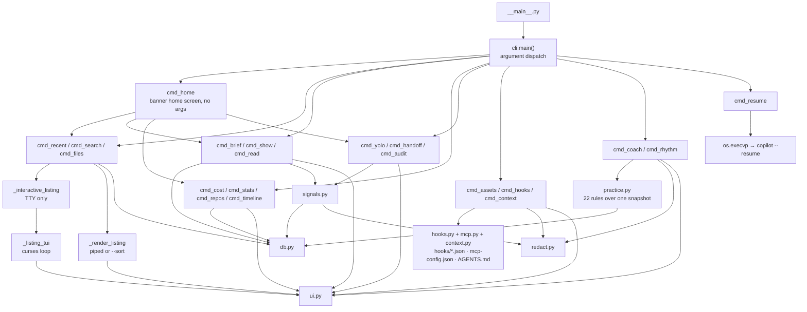
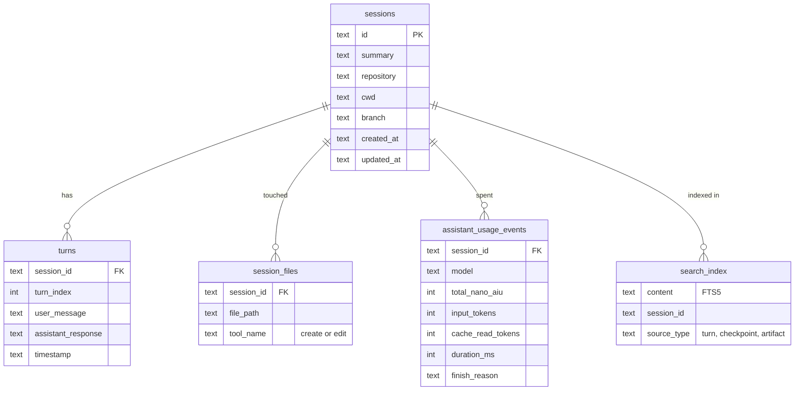
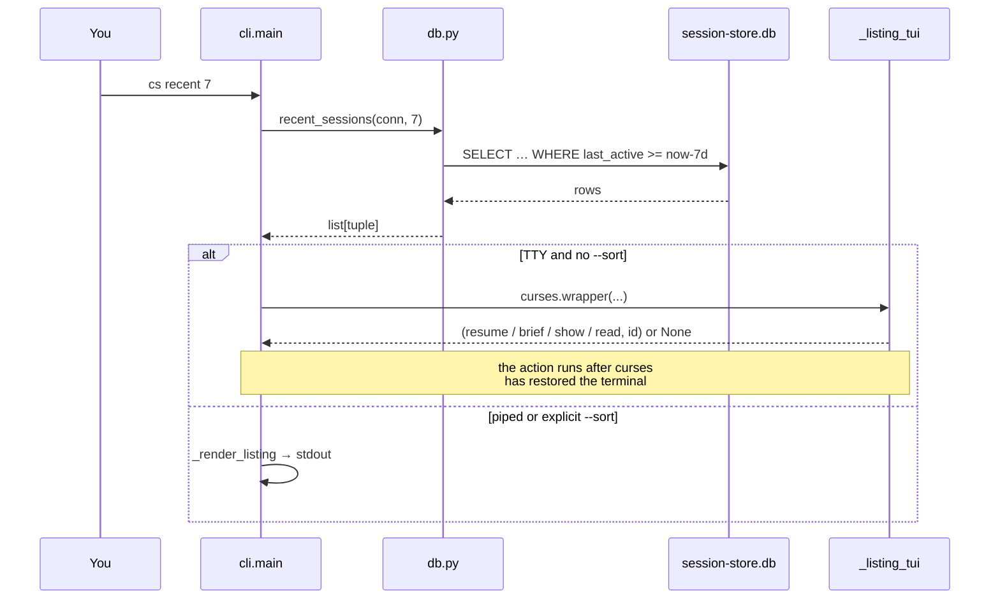
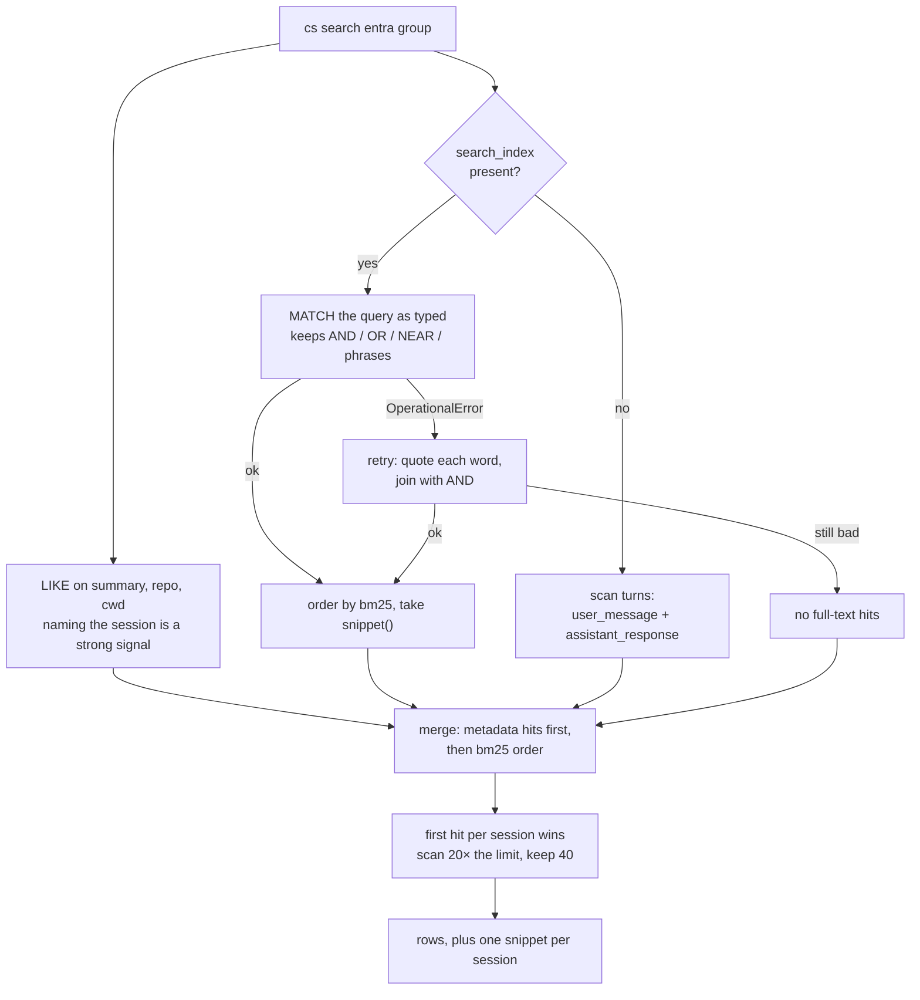
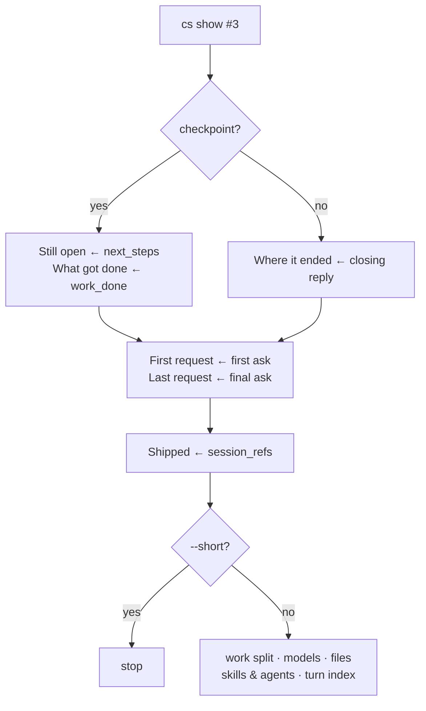
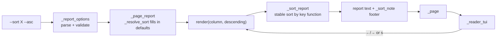
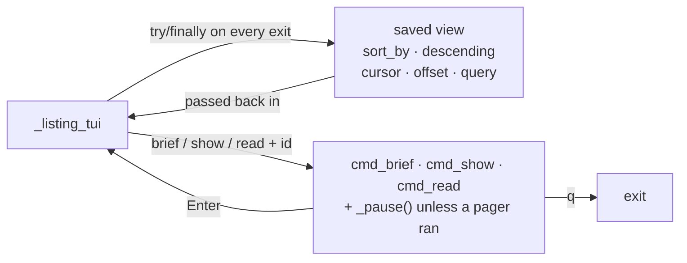
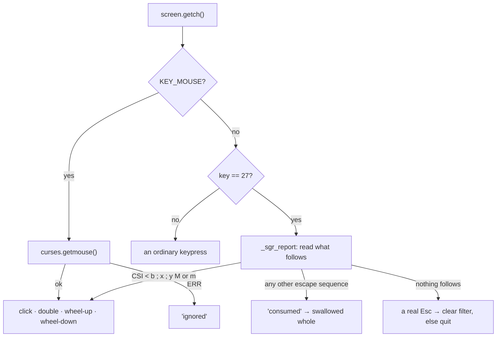
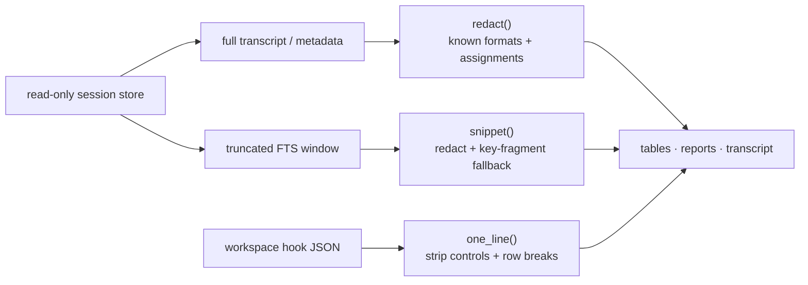
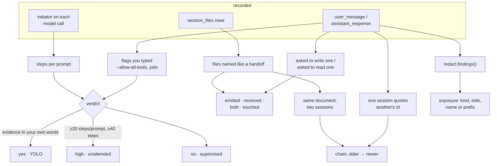

# Architecture

How `cs` is put together, and why the awkward parts are the way they are.
For usage see [README.md](README.md); for the state of the work and the
decisions behind recent changes see [docs/HANDOVER.md](docs/HANDOVER.md).

- [Shape of the code](#shape-of-the-code)
- [The data it reads](#the-data-it-reads)
- [Request flow](#request-flow)
- [Search pipeline](#search-pipeline)
- [The interactive listing](#the-interactive-listing)
- [Input handling](#input-handling)
- [Degrading gracefully](#degrading-gracefully)
- [Presentation layer](#presentation-layer)
- [Masking credentials](#masking-credentials)
- [Testing approach](#testing-approach)

---

## Shape of the code

Ten modules, one rule each: `db.py` knows SQL and nothing about formatting,
`signals.py` reads inferences out of the store and nothing about drawing them,
`practice.py` reads habits across a window of it, `hooks.py`, `mcp.py` and
`context.py` read configuration off disk and never touch the store,
`redact.py` owns every credential pattern, `ui.py` knows formatting and nothing about sessions,
`export.py` owns the machine-readable edge — the same readings without the
drawing — and
`cli.py` joins them and owns everything interactive.



The split between `db.py` and `signals.py` is the split between *recorded* and
*inferred*. Anything `db.py` returns is a fact the store holds. Anything
`signals.py` returns is a reading of those facts, and always arrives with the
evidence attached — which is why the two live apart rather than one growing a
"clever" half.

`practice.py` is on the inferred side, one level further out. `signals.py`
asks what one session was; `practice.py` asks what a month of them says about
the person driving. The design rules that keeps that honest are written into
the module rather than left to each rule:

- **One snapshot, many rules.** `snapshot(conn, days)` reads the window once
  into plain dataclasses; no rule touches the database. Twenty-two rules over
  4,300 turns and 32,000 usage events runs in under half a second.
- **A minimum sample, always.** Each rule returns `None` below its sample
  rather than a reassuring zero, and the report's footer says that silence
  means "not enough to say".
- **Evidence or nothing.** Every `Finding` carries `count`, `total` and up to
  three real examples. The CLI masks them at the render edge like any other
  session text.
- **A recomputable score.** A group starts at 100 and each finding costs
  `COST[severity]`. There is no weighting, no curve and no smoothing, so the
  printed list is the whole calculation.
- **The harness is not the user.** `clean()` strips injected blocks
  (`<system-reminder>`, skill preambles, command echoes) before a prompt is
  judged, and `db.ignored_prefixes()` drops scheduled runs — without both, the
  loudest findings are about cron jobs.

`hooks.py`, `mcp.py` and `context.py` sit outside the split entirely. None of
them reads the store, because none has anything to read there: a hook is not
something a session did, an MCP server is not something a session installed,
and an instruction file is not something a session wrote. They report what
*will* happen on the next session — and every view
built on them says so, rather than letting a configuration inventory be
mistaken for a usage count.

`export.py` sits at the opposite edge from `ui.py`. Both are outputs, but
`ui.py` draws for a person — it wraps, colours, rules a heading and footnotes
a number — and none of that survives a pipe. `export.py` hands back the same
figures as plain data for `--json` and `--csv`, deliberately as a *separate*
path rather than a flag threaded through the renderers: a report serving two
audiences in one function serves neither, and the drawn views stay free to
change layout without changing anyone's contract. Two rules hold there —
redaction is not optional, because piping is exactly when text stops being
glanced at and starts being stored; and a reading the store cannot answer is
left out rather than emitted as a zero.

`db.py` returns plain tuples, never formatted strings. Listings share one row
shape throughout:

```
(session_id, last_active, summary, repo, cwd, turns, nano_aiu)
   [0]           [1]         [2]     [3]   [4]    [5]      [6]
```

Sort columns index into that tuple (`_SORT_COLUMNS` in `cli.py`), which is why
every listing — recent, search, files — sorts, filters and numbers the same
way for free.

---

## The data it reads

Copilot's store holds more than `cs` uses; these are the tables it touches.



Two details that shape the code:

- **Spend is per event, not per session.** Every listing needs a session's
  total, so `_aiu_sub()` builds a correlated `SUM(total_nano_aiu)` subquery
  that is spliced into whichever query needs it. Credits are stored in
  *nano*-AIU; `ui.fmt_aiu()` is the only place that divides by 1e9.
- **Last activity is `MAX(created_at, updated_at)`** — the scalar two-argument
  `MAX`, not the aggregate. Some sessions have an `updated_at` older than
  their `created_at`.

---

## Request flow

A listing command, end to end:



The action is deliberately returned rather than performed inside the curses
loop. `resume` needs a clean terminal to hand to `copilot`; `brief`, `show`
and `read` need normal stdout (and, for `read`, a pager). Doing that work
inside curses would fight the screen.

---

## Search pipeline

`cs search` has to satisfy three things at once: rank by relevance, never miss
a match, and survive whatever the user types. FTS5 rejects punctuation
(`three.js`, `C++`) as a syntax error, so a raw query alone is not enough.



The snippet travels beside the rows rather than inside them, keeping the row
tuple stable. `_render_listing` prints it under each row; the TUI shows the
highlighted row's snippet above the status bar.

**Relevance as a sort column.** Results arrive best-first, and `#N` is handed
out in arrival order — so relevance *is* the `#` column. `_SORT_COLUMNS` gives
it a `None` index, and `_sort_rows` sorts by the numbering map instead of a
tuple field. That is why `←`/`→` can cycle onto it and why clicking the `#`
header restores best-match order.

---

## Building the session page

`cs show` answers "what is still open here" without reading the session. The
inputs are uneven — only ~11% of sessions carry a checkpoint — so the digest
degrades in stages rather than emptying out.



The page runs **judgement first, then inventory**. That ordering is the whole
design: what is still open changes what you do next, and spend by model does
not, so the thing that changes your behaviour goes at the top and the evidence
for it goes underneath.

This used to be two commands. `cs brief` was the judgement and carried nothing
else; `cs show` was the inventory and carried nothing else; the stated rule was
that no fact appeared in both. The rule was sound and the split was wrong —
they answered *what happened* and *what it cost*, and nobody wanted one without
the other, so in practice every `brief` was followed by a `show`. `--short`
replaces the split: it prints a **prefix** of the page rather than a different
page, and it skips the six inventory queries while it is at it, which is what
the separate command was really buying. `cs brief` survives as an alias.

The conversation still belongs to `cs read` alone — a transcript is the one
thing that cannot be summarised without becoming something else. What the two
views share is `_session_header()` and `_session_footer()` — one set of words
for repo, span and volume, one reading width, and one line naming where to go
next.

Three extraction rules do the real work, and each exists because the raw text
broke the naive version:

- **Asks are cleaned before use.** Copilot injects `<system_reminder>` blocks
  carrying a repo's custom instructions into `user_message`; 50 turns in a
  1,000-session store are nothing but those. They are stripped, and a turn
  left empty is dropped, so "13 turns" means thirteen things the user asked.
- **`important_files` is prose, not a list.** Paths are extracted only when
  anchored — a leading `/`, `~`, `./`, a trailing `/`, or a file suffix — which
  keeps `/tmp/a/build.py` and `~/.config/app/` while rejecting `reads/writes`
  and `owner/repo`. A bare `sync.sh` counts only inside backticks, or every
  "Node.js" in the prose would arrive as a file.
- **Nothing is truncated.** Items wrap with a hanging indent and
  `break_on_hyphens=False`, so `no-secrets` and `--format='%an'` stay copyable.
  An earlier version clipped each line to the terminal width; it read as a
  teaser and told the reader nothing.

Long output is handed to the pager rather than dumped: `_capture()` collects
what a renderer printed, `_page()` decides whether it fits, and `less` is asked
for `--mouse --wheel-lines=3` when a version probe (cached per binary) says it
is new enough. That is why `brief`, `show` and `read` all scroll with the wheel
while keeping plain `print` bodies.

Ordering is the other half of the design: **Still open** comes first because it
is the only section that changes what the reader does next, then what got done,
then the goal and the final request. The full turn list is behind `--asks`.

## The home screen

`cs` with no arguments opens `cmd_home()`: a curses menu over `_home_items()`,
which is one line per view — label, description, the callable to run, and
whether it needs text first. Every action is callable and only one entry
(Search) needs a term, so choosing a row cannot call something that isn't
there: the menu collects the term and `cmd_home` passes it in.

The loop is the same shape as the listing's: the menu **returns a choice**, the
action runs after curses has restored the terminal, and then the menu is drawn
again. That is what makes every view a round trip rather than a dead end, and
it is why each action reports whether it already waited for the user:

| Action returns | Meaning | What the menu does |
|---|---|---|
| `True` | a pager ran, or a full-screen listing did | redraw the menu at once |
| `False` / `None` | it printed straight to the terminal | `_pause()` first |

`_interactive_listing` answers that question honestly rather than assuming:
with nothing to list, or on a terminal curses cannot drive, it prints and
returns `False`. A blind `True` there wiped "No sessions found." on the next
redraw, which is the whole failure the flag exists to prevent.

### Laying the menu out

Three things compete for rows — the wordmark, the fourteen options, and four
group headings — and the wordmark's height depends on how many rows the other
two want. `_home_header_rows()` breaks that circle: it works out how tall the
header *would* be for a proposed menu height without drawing anything, so the
loop can price a layout before committing to it.

Headings are then bought only out of genuine slack. They are dropped if the
options would not all fit, and also if paying for them would push the banner
down a size — which is why a 24-row window keeps the compact wordmark and all
fourteen options and simply goes ungrouped. `_home_layout()` returns the drawn
rows as `('head', title)` and `('item', index)`, and scrolling, clicking and
the cursor all work off that list rather than off the item list, so a heading
is a row that takes space and cannot be chosen.

### The activity strip

`db.activity(conn, days)` returns sessions per day, oldest first, **dense** —
a day with nothing still gets its zero. `db.timeline` is a different shape
entirely: sparse (only the days that have rows) and four-wide (day, sessions,
turns, spend), because the report it feeds is a ledger rather than a chart. A
sparkline built from a sparse series closes the gaps up and draws a busy
fortnight and a quiet quarter as the same shape, which is why the strip does
not share the query.
`ui.sparkline` scales to the peak of the series and maps zero to a blank
rather than to the shortest block, so "quiet" and "barely busy" stay
distinguishable.

It is read once, in `cmd_home`, and carried in the menu's `state`: the wipe
redraws the header fourteen times and a query per frame would be fourteen
queries to draw one unchanging line. An all-zero series is discarded at load,
so an empty store spends no row on a flat chart.

The strip rides with the wordmark in `_home_header_rows` — a window too short
for one is too short for the other. That is what keeps the arithmetic straight
rather than circular: the row count depends on the banner, the banner depends
on the rows left over, and pinning the two together means the sum resolves in
one pass.

### The wipe

`ui.banner_palette()` builds the purple→cyan ramp as curses colour pairs from
40 up (`tui_theme` owns 1–14, `sgr_palette` 20–26) and returns an empty list
below 256 colours. `ui.gradient_runs()` cuts a banner line into bands by
*position*, so the wordmark matches the splash instead of being the same art
in a flat blue, and a frame costs about eight writes per line rather than
fifty-four.

The reveal is a wipe, not a loop. A curses screen is still because `getch()`
blocks; the menu arms a timeout (`ui.REVEAL_MS`) and counts frames, and
`ui.reveal_columns()` turns a frame into how far the wipe has travelled.

Three things shape how it looks:

- **It is eased**, `1 - (1 - t) ** 1.5`. Linear reads as a machine drawing.
  The exponent is 1.5 rather than the usual 2 because squaring leaves the
  last three frames one column apart — an ending that looks like a hang.
- **The edge is a slant.** Each banner row is offset `ui.REVEAL_LAG` columns
  behind the one above, so the travel is `widest + lag × trailing_rows` and
  the bottom row still lands on the final frame.
- **The activity strip is one more row of that slant**, drawn as a fraction
  of the wordmark's travel rather than a column count of its own, so a
  120-cell strip and a 54-cell wordmark finish together.

After about fourteen frames — or the instant any key arrives — `settle()`
clears the timeout and records `state["revealed"]`,
and the screen never redraws itself again. Two details matter: the flag lives
in the menu's `state`, so returning from a view does not replay the greeting,
and a `-1` when no wipe is running means "nothing typed" rather than advancing
a counter that is `None`.

`_HOME_ACTIVE` is set while the menu owns the loop. Two things read it: the
listing's hint line (`q home` rather than `q quit`) and `_page()`, which sends
text to `_reader_tui()` instead of `less`. That is not a preference —
`less` cannot be made to treat Esc as back, because Esc is its meta prefix, so
a lesskey binding for it waits for the next byte rather than acting (measured,
with `LESSKEYIN`). Away from the menu `_page()` still uses `$PAGER`, which
keeps scrollback and is the better reader.

The reader wins over `_page()`'s own "it fits, just print it" shortcut, which
is only right away from the menu. Inside it, a report that fits printed onto
the terminal *underneath* the menu — different colours, no hints, no Esc. The
Files overview is capped at 25 rows and so lands at exactly 30 lines, which is
why it, alone, took that path on a normal window and looked like a different
program.

`_reader_tui()` has to paint text that was built as ANSI escapes for a plain
terminal, so `ui.sgr_runs()` splits each line into (text, curses attribute)
runs against a palette from `ui.sgr_palette()`. The palette covers exactly the
codes the reports emit — enumerated from their real output, not guessed — and
its colour pairs start at 20 to stay clear of `tui_theme()`'s 1-14.

### Sorting a report

Listings share one row tuple, so `_SORT_COLUMNS` maps a column name to an
index. Reports do not: some rows are tuples straight from SQL, some are dicts
built in `signals.py`. A report column is therefore a **key function**, which
reads either shape without the sorter caring which it got.



`_page_report` passes the **renderer**, not its output. That is what lets
`←`/`→` re-sort without leaving the reader: the report is rebuilt from the
store's rows, so a sort is always a real sort rather than a reshuffle of
already-formatted lines.

Three constraints shaped the details:

- **Defaults are the existing order.** The first column in each spec is the
  default and matches what SQL already returned, so adding sorting changed no
  output until someone asked for it. The sort is stable, so ties keep that
  order too.
- **The active column is marked with colour, not an arrow.** Reports pad each
  column to the width of its heading word; adding a character would push every
  row out of line. The direction goes in the footer, where there is room.
- **`cs files` is a listing, not a report.** `_report_options` takes
  `report=None` for it and dispatch checks `--sort` against the listing's
  columns, because what comes back is sessions.

`cs stats` and `cs agents` deliberately take no `--sort`: one is a column of
scalar facts, the other a narrative breakdown. Neither is a table.

**Every loop that reads keys must decode mouse reports before it tests for
Esc.** Under SGR a wheel tick arrives as `Esc [ < 65 ; x ; y M`, so a loop that
checks `key == 27` first sees the Esc and acts on it — which made scrolling a
report jump back to the menu, and made scrolling mid-filter cancel the filter
and then type `[<65;20;10M` into it. `_mouse_event()` exists precisely to
resolve that ambiguity, returning `'ignored'` for a report that means nothing
here rather than `None`, which is reserved for a genuine keypress. All four
loops now go through it: `_listing_tui`, `_home_tui`, `_reader_tui` and
`_prompt`.

Esc is back everywhere, which needs `_pause()` to see a keystroke rather than a
line: typed into `input()`, Esc is just another character and the user is still
stuck until they press Enter. `_read_key()` puts the terminal in cbreak for one
character and restores it, then drains — an arrow key is Esc plus two more
bytes, and those leftovers would otherwise be read as keystrokes by the next
screen. Where the terminal cannot be put in cbreak it returns `None` and
`_pause()` falls back to reading a line.

Piped or redirected, `cmd_home()` falls back to the splash plus today's
sessions, so `cs | head` behaves as it always did.

### The banner

`ui.banner(width, height)` returns the largest wordmark that fits, padded to a
rectangle so centring cannot leave it ragged. `_draw_home_header()` decides how
much height to offer:

```
spare = height - 4 - len(items)      # keys, facts, rule, status bar
```

That is deliberately the space left *after* the menu, not before it. A banner
that pushes options off the screen has cost more than it gave, so on a 24-row
window the full seven-line mark steps down to a four-line one, and below about
20 rows it gives up its space entirely and the old title line returns. Each
step is a real terminal size, and `banner()` is pure — it takes two numbers and
returns lines, which is why it can be tested without a terminal at all.

## The interactive listing

One curses window, drawn from scratch each keystroke:

```
 row 0   ◆  Sessions · last 7 days · … · sorted by active ↓     ← heading
 row 1   click · ↑↓ · ←→ · ↵ resume · v brief · t read · q home  ← key help, fitted
 row 2
 row 3     #↑ Active      Turns  Credits  Summary      Repo     ← headers (clickable)
 row 4   ────────────────────────────────────────────────────
 row 5     1  08-03T17:03  13     4.2k    Migrate CI …          ← rows, `visible` of them
   …
 row h-2  next steps: wire the charts to live data              ← search hit (search only)
 row h-1   3 of 299 sessions · Enter resumes, or 'cs resume 3'  ← status
```

State that survives a trip out to a detail view and back:



The save is in a `finally`, so no return path can forget it — there are six
ways out of that loop.

**The key help fits the window.** It was one fixed string, so a narrow terminal
truncated it mid-word and hid the keys at the end — `t transcript` and `q quit`
among them. `_hint_line()` now holds a long and a short form per hint plus a
rank; it tries both forms whole, then drops hints by rank. The way out ranks 0
and never drops, so no width leaves the view without a visible exit.

**Numbers are identity, not position.** `_number_rows()` assigns `#N` once, in
the listing's natural order, and the map is written to `$COPILOT_HOME/.cs-last-index`
so `cs read #3` works in a new shell. Sorting re-orders rows but never
renumbers them, and `follow` re-finds the highlighted *session* after a
re-sort so the cursor doesn't jump to whatever landed in that slot.

---

## Input handling

The fiddliest part of the codebase, for a reason worth writing down.

**Two mouse protocols are enabled at once.** Python is commonly built against
an ncurses whose mouse ABI predates button 5 — on such a build
`curses.BUTTON5_PRESSED` is literally `0x0`, so **wheel-down can never arrive
through ncurses**. It does reach the app as `KEY_MOUSE`, but `getmouse()`
returns ERR with no data. The fix is to also switch the terminal into SGR
reporting (`\033[?1006h`), which only changes the *encoding* of the same
events. Terminals that understand it send reports ncurses passes through
untouched, for `_sgr_report()` to decode; terminals that ignore it keep
sending X10, which ncurses still decodes.



Three traps, all of which bit during development:

1. **`ALL_MOUSE_EVENTS` breaks double-click.** With raw `PRESSED` in the mask,
   ncurses reports every press verbatim and never synthesises
   `BUTTON1_DOUBLE_CLICKED`. The mask asks only for resolved clicks.
2. **An SGR report begins with Esc.** The press half of a click is consumed
   but not acted on — returning "nothing" for it made every click read as a
   bare Esc and quit the app. Hence the explicit `'ignored'` kind: *not a
   mouse report* and *a report I don't act on* must not be the same answer.
3. **Unknown escape sequences must be swallowed.** A stray `ESC [ C` (the
   normal-cursor-mode arrow, which `keypad(True)` usually replaces with
   `ESC O C`) would otherwise fall through to the quit path.
4. **Queued reports outlive the app.** A flick of the wheel produces reports
   far faster than any redraw consumes them, so when a view stops reading,
   hundreds can still be sitting in the terminal's input queue — the shell
   reads them next and echoes the raw escapes over its own prompt. Order
   matters twice over: reporting has to be switched off *before* `endwin`,
   because once the terminal is back in cooked mode a late report is echoed
   the instant it arrives, too soon to drain; and the queue has to be drained
   *after* `endwin`, because reports keep arriving until ncurses stops its own
   reporting. `_disable_mouse()` therefore runs on both sides, writing the SGR
   switch-off once and draining each time.

Bytes read while probing go onto a `pending` queue owned by the loop rather
than through `curses.ungetch`, so a real Esc followed by another key never
loses that key — and the whole path is testable without an initialised
terminal.

---

## Presentation layer

`brief`, `show`, `read`, `stats`, `agents` and `skills` are one product, not
six scripts, because they share primitives in `ui.py`:

| Primitive | Job |
|---|---|
| `rule(width, title)` | `── Title ─────────` section and document rules |
| `heading(text, colour)` | `▌Label` — an accent bar rather than shouting |
| `field(label, value)` | aligned metadata; the column always leaves a gap |
| `_spend_row/_spend_header` (`cli.py`) | one column shape shared by every spend breakdown |
| `_fit_columns/_cell` (`cli.py`) | how wide a table's columns may be here, and one padded cell |
| `markdown(text, width)` | headings, bullets, tables, fenced code, inline `code`/**bold** |

`markdown()` is what makes a transcript readable: assistant replies *are*
markdown, so bullets get a hanging indent, fenced code keeps its alignment
behind a `│` gutter, and inline styling renders in colour — or has its markers
stripped when colour is off, so piped output is clean prose rather than raw
syntax.

Columns hold still because of one rule: **the only variable-width field goes
last.** A bar or an unpadded count in the middle of a row shifts everything
after it the moment a value gains a digit, so every spend, stats and timeline
row is fixed-width up to its final free-form field. `field()` widens its
gutter for any label longer than nine characters, which silently breaks a
block's alignment — so labels are kept to eight.

`_fit_columns` decides the rest: it is given the columns that may be dropped
**in the order they are worth losing**, and removes them one at a time until
the free-form last column reaches a readable minimum. Hand-tuned width steps
were wrong at both ends — rows ran off a small window, and a wide one paid for
a column nobody had budgeted. Both `handoff` and `audit` build their heading
row and their data rows from **one list of columns**, so the divider cannot
drift out of step with the rows it divides, which is exactly how it came to
stop 25 columns short of them.

Two details earn their code:

- **Styling survives wrapping.** Inline markers become one-character
  sentinels *before* `textwrap` runs and escape codes *after* it. Applied the
  other way round, a `**span**` broken across two lines matches neither half
  of its own regex, and raw `**` reaches the screen.
- **Tables become columns.** A `| a | b |` block is buffered whole — widths
  are only knowable at the end — then padded to aligned columns with the
  `|---|` divider drawn as a rule under the header. Width is counted in
  terminal cells, not characters, because a reply full of ✅/⬜ would
  otherwise shear every column to their right.

Long output is handed to the pager: `_capture()` collects what a renderer
printed, `_page()` decides whether it fits, and `less` is asked for
`--mouse --wheel-lines=3` when a cached version probe says it is new enough.

## Masking credentials

`redact.py` sits between the store and the screen. Every path that prints
session-derived text — transcripts, briefs, overviews, search snippets, listing
summaries and TUI rows — passes through it.



The three inputs need different handling. Transcript prose keeps its newlines;
metadata and hook fields destined for one table row go through `one_line()` so
an embedded newline cannot forge a second row. FTS text is less complete than
either: a window may contain the body of a private key without its identifying
header or footer, so `snippet()` additionally suppresses long, mixed-case
base64 fragments. File-search hits bypass that FTS-only rule because an
ellipsis can be a legitimate part of an abbreviated path.

Two rules keep it useful rather than annoying:

- **Specific shapes are labelled.** `AKIA…` becomes `[redacted:aws-key-id]`,
  `ghp_…` becomes `[redacted:github-token]`, and a private-key block is masked
  header to footer. Knowing *what kind* of secret was there is often the point.
- **Assignments need a secret-shaped value.** `password=`, `secret:`,
  `api_key=` mask their value only when it is not a bare number and not a
  placeholder — because sessions about AI talk about tokens constantly.
  `total tokens: 15234`, `max_tokens = 4096` and `api_key: ${API_KEY}` are
  left alone. Masking those would train users to ignore the mask.

The store is opened read-only and never rewritten; masking is display-only,
and `CS_REDACT=0` restores the raw text.

`redact.py` has a second, audit half. `redact()` rewrites text for the screen;
`findings()` returns `(kind, hint)` for every credential-shaped span **without
the value** — a public prefix (`ghp_…`) or the identifier it was assigned to
(`DB_PASSWORD`). One set of patterns serves both, so a shape that gets masked
is a shape that gets counted, and the two can never drift apart.

Overlap is resolved by claiming character spans: rules run most-specific first,
and a later rule skips anything an earlier one already covered. Without that,
`password=ghp_…` would be reported twice under two different names. The
placeholder rule also treats `[redacted…]` as a non-secret, so a value the
specific rules already labelled is not masked a second time by the generic
one — that was quietly turning `AccountKey=[redacted:azure-storage-key]` back
into an unlabelled `[redacted]`.

### Where the audit looks

A session can hold a credential three different ways, and text scanning only
answers the first:

| Source | Read by | Why it is separate |
|---|---|---|
| `turns` | `signals.exposures` | the obvious one |
| `checkpoints` | `signals.exposures` | the latest saved record, written by the agent and opened by `cs show`; older checkpoints are skipped because no command opens them exactly |
| `session_files` | `signals.sensitive_files` | proves a sensitive path was created or edited; it does **not** prove the contents were read |

Checkpoint findings get their own `side`, so they are never reported as
something you pasted and never offered a `--turn` to open — there is no turn
number, and `--turn 0` would land on the first message of the session. Only
the latest checkpoint's first five `next_steps` and `work_done` items are
scanned, exactly matching what `cs show <id>` can display.

`sensitive_files` is a list of path patterns rather than a text scan: `.env`,
`id_rsa`/`id_ed25519`, `.aws/credentials`, `.kube/config`, `.npmrc`/`.netrc`,
`*.pem`/`*.p12`/`*.jks`, `*.tfstate`, `*secrets*.yaml`. It is the one part of
the audit with the exact relative paths underneath each row. It is a path
warning, not a claim that the credential contents were seen.

**A finding is ranked by how certain it is, not by what it opens.** `SEVERITY`
maps each kind to `critical` (a documented key format — `AKIA…`, `ghp_…`, a
private-key block: it can be nothing else), `high` (a credential-carrying
shape — a JWT, a bearer token, a login in a URL) or `medium` (the generic
assignment kind, where a password-ish name had a secret-shaped value: credible,
but sometimes prose). This is the only ranking the module can make honestly —
nothing in the store says whether a key is for a sandbox or for production.
`signals.exposures` ranks a session by the worst kind in it, so one leaked
private key outranks thirty password-shaped assignments rather than sorting
below them on count.

Precision matters more here than anywhere else, because a report that is
nine-tenths false positives does not get read. The assignment rule therefore
requires the name to **start at an identifier boundary** — either nothing
lowercase runs into it (`DB_PASSWORD`, `SpMS_DBPassword`) or it begins a new
word (`jdbcPassword`). Without that boundary every `bypass:`, `compass:` and
`passing:` in English prose was reported as a credential.

## Inferring what the store does not record

Three governance readings live in `signals.py`. None of them is a column, and
each carries the evidence it was drawn from.



**Autonomy.** `initiator` separates calls you asked for (`user`) from steps the
agent took by itself (`agent`, `sub-agent`), so steps-per-prompt measures how
far a session ran between check-ins — the thing YOLO mode actually changes.
Explicit evidence only counts from *your* messages: the store is full of the
agent explaining `--allow-all-tools`, which is not the same as it having been
used. The thresholds (`UNATTENDED_RATIO`, `UNATTENDED_STEPS`) were read off the
real distribution — the median session is 2 steps per prompt, the 95th
percentile 17, so 20 over 40+ steps isolates the top couple of per cent.

**Handoffs.** Nothing links two sessions, but a handoff document does: both
open it, and `session_files` records that. Edges are only ever built from
evidence — a shared document, or one session quoting another's id — and always
point older → newer, so the graph is acyclic by construction and `chain()` can
walk the connected group without ordering guesses. Building the edge list reads
every turn, so callers drawing more than one chain build it once and pass it in;
that alone took `cs handoff` from 2.7s to 0.27s on a 1,000-session store.

**Exposure.** `exposures()` runs `redact.findings()` over every stored turn and
groups by session, keeping which side the credential came from — one you typed
is a paste into the chat; one in assistant output has unknown provenance. It
costs a full scan (~1.7s over 4,600 turns), which is why it is an explicit
command and not a column in every listing.

## Inferring asset usage

The Copilot CLI store records **no skill or agent invocation event**, and
`agent_id` on a usage event is the delegating tool-call id — unique to one
session, so counting distinct values counts *delegated tasks*, not agent
identities. Two consequences the code has to live with:

- `cs agents` reports delegation volume and says, in its own output, that no
  agent name exists in the data.
- Named usage is inferred by matching session text against the assets actually
  on disk (`~/.copilot/skills`, `~/.copilot/agents`, plus a workspace
  `.copilot/`).

That inference is precision-first, and it was tuned against real data rather
than guessed:

| Evidence | Counted | Why |
|---|---|---|
| `skills/commit`, `agents/reviewer` | ✅ | the asset's own path |
| `commit.skill.md` | ✅ | its filename |
| "the handover skill", "skill deploy-check" | ✅ | named as an asset |
| `` `commit` `` | ❌ | usually git, in a backticked code span |
| `/commit` | ❌ | usually a path segment |
| `acme/webshop`, `.github/workflows/` | ❌ | repo and directory names |

Each rejected form was measured: a naive substring match scored the `commit`
skill at 259 sessions, slash-and-backtick forms at 54, strong evidence at 15.
The result undercounts, and the UI says so — a number that is too high is
worse than one that is careful.

All three callers share one fixed pattern (`_asset_hits()`) that matches the
*shape* of a reference and captures whatever name sits in it; the caller then
looks that name up. Building an alternation of every known name instead meant
four copies of a 125-way alternation and took 4.7s over this store against
0.8s — long enough that opening Skills from the menu looked like it had hung.

Capturing the whole token is also stricter. The alternation ended at a word
boundary, so `agents/mule-triage` counted as the `mule` asset and
`agents/HANDOVER-deckforge` as `handover` — the same false positive the
comment already warned about for `workflow`.

## Degrading gracefully

Session stores differ by Copilot version, and an open-source tool meets every
one of them. Two rules keep that honest, and they are written down in `db.py`
as `ESSENTIALS` and `OPTIONAL` rather than left to each query's author.

**Essential** is what makes a file a session store at all:

```python
ESSENTIALS = {
    "sessions": ("id", "created_at", "updated_at"),
    "turns": ("session_id", "turn_index", "user_message", "assistant_response"),
}
```

`connect()` checks it once and exits with the shortfall in English —
`missing the sessions table`, `missing sessions.updated_at`. Pointing
`COPILOT_HOME` at the wrong directory is the common first mistake, and a raw
`sqlite3.OperationalError: no such table: sessions` is a poor way to learn it.

**Everything else is optional**, and asked for before it is used. Optional
*tables* are probed with `_has_table`; optional *columns* go through
`db.optional()`, which returns either the column or a literal to stand in
for it:

```python
def optional(conn, table, column, alias="", default="NULL"):
    if not _has_columns(conn, table, column):
        return default
    return f"{alias}.{column}" if alias else column
```

That is the whole trick, and it is why a store with no `repository` column
still lists every session — it simply cannot say which repository each
belonged to. An absent column is a **missing answer, not a broken query**.
`signals.py` writes its own SQL over the same tables and uses the same helper,
so the two degrade together rather than one of them taking the report down.

`db.capabilities()` returns the lot as a `{name: bool}` map, which is also
what the capability tests assert against: a full store answers everything, a
store with only the essentials answers nothing optional, and neither one
raises.

Feature by feature, an absence costs exactly this much:

| Missing | Effect |
|---------|--------|
| `sessions.repository` / `cwd` / `branch` | Sessions list and sort as normal, unattributed |
| `sessions.summary` | Rows read `(untitled)`; search matches on the other fields |
| `turns.timestamp` | `cs read` shows turns without times |
| `session_files.tool_name` | Files are listed as touched rather than created/edited |
| `initiator` / `agent_id` columns | `cs agents` exits with the reason; `show` drops the work-split panel |
| `session_refs` | commits and PRs read as zero in `stats`, section hidden in `brief` |
| `checkpoints` | `brief` falls back to the closing reply and file list |
| `search_index` | `search` scans `turns` instead — no ranking, no snippets |
| `session_files` | `cs files` finds nothing; the Files panel disappears from `show` |
| `assistant_usage_events` | Credits show `-`; `cs cost` exits 1 with a clear message |
| No colour (`TERM=dumb`, piped) | ANSI is suppressed at import time in `ui.py` |
| No usable terminal | `_interactive_listing` falls back to the plain listing |

---

## Testing approach

Tests never read real data: `setUp` builds a synthetic store in a temp
directory and points `COPILOT_HOME` at it.

The curses listing is driven through a fake `Screen` that serves a queue of
keys and records every frame as `{(y, x): text}`, so assertions read the
screen the way a user would:

```python
screen = Screen([curses.KEY_RIGHT, ord("q")])
_listing_tui(screen, rows, "Sessions")
assert "sorted by turns ↓" in screen.frames[-1][(0, 0)]
```

Mouse behaviour is tested by feeding the actual byte sequences a terminal
sends (`ESC [ < 65 ; 21 ; 11 M` for wheel-down), which is what caught the
press-versus-Esc bug above. The fake honours `nodelay` — an empty queue
returns `-1` instead of blocking — because that is precisely the condition
that distinguishes a bare Esc from the start of a mouse report.
