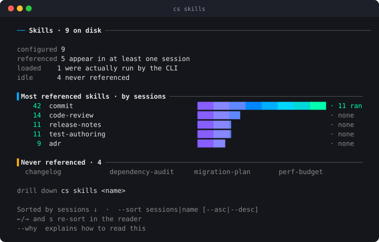
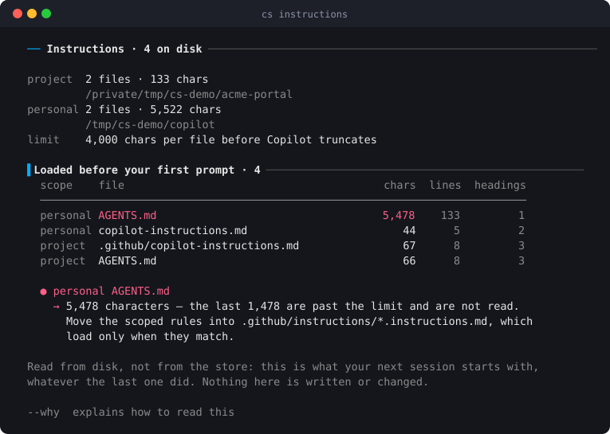
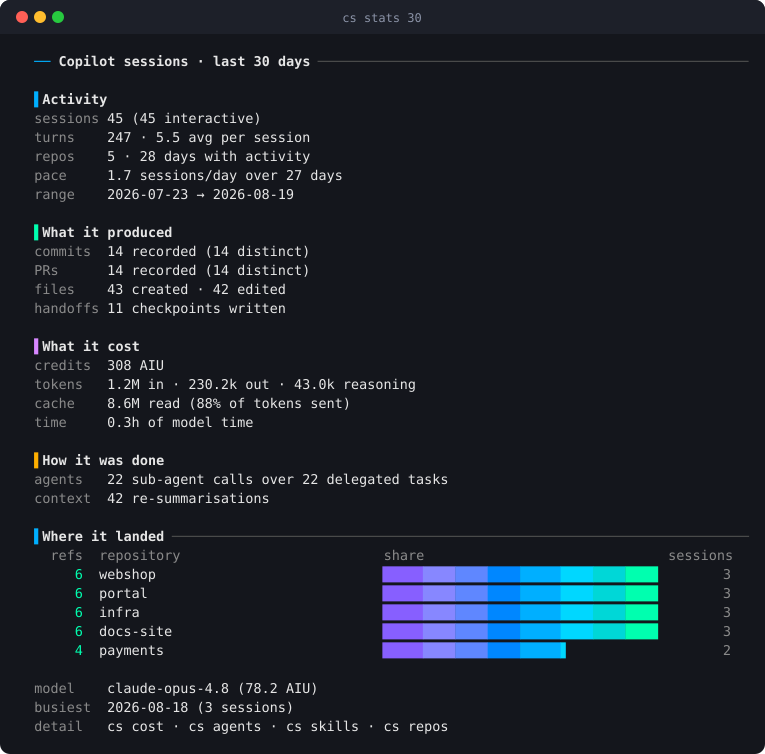
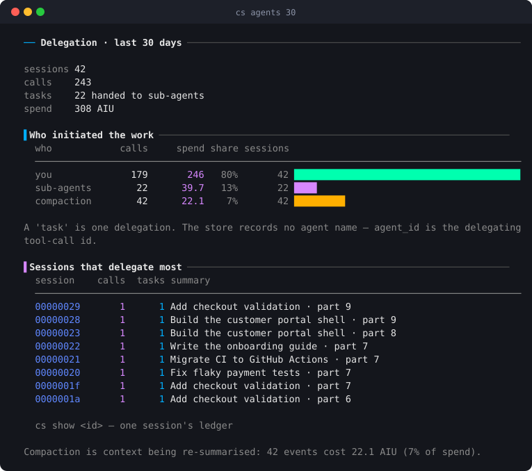
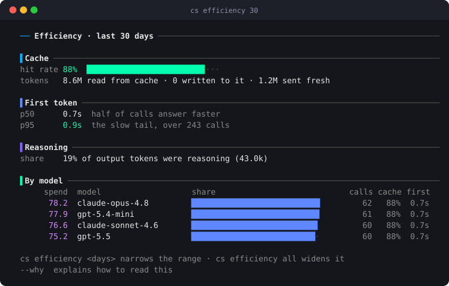
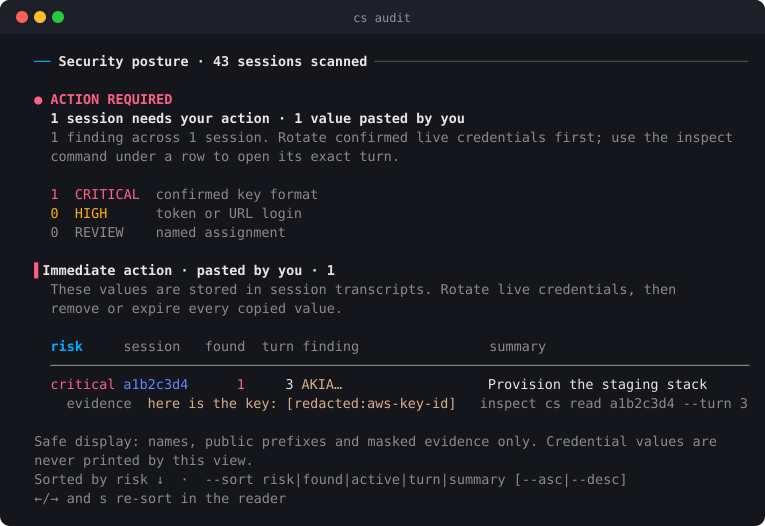
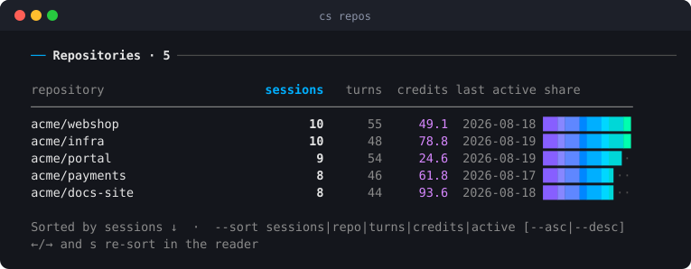

<div align="center">

# `cs` — Copilot Sessions

**A terminal app for everything your GitHub Copilot CLI already remembers.**
Browse, search, read, audit and resume any past session — without leaving the shell.

[](https://github.com/smaharajan/copilot-sessions/actions/workflows/ci.yml)
[](LICENSE)
[](https://www.python.org/)
[](#-install)
[](#-privacy)
[](#-privacy)

</div>

Nothing you did with Copilot is actually lost. Every turn, every file it
touched, every credit it spent is sitting in a SQLite file on your disk right
now. What you don't have is a way to *look*.

`cs` is that way — a full terminal application over the session store, with a
home screen, arrow-key navigation, live filtering, and a view for each question
you actually ask. It never writes to the store, makes no network calls, and
needs nothing beyond Python itself.

> **Every screenshot below is a real run**, produced by
> [`docs/img/make_screens.py`](docs/img/make_screens.py) against a synthetic
> store. Nothing here is a mock-up, and nothing here is anybody's real session.

---

## 🖥️ Run it with no arguments and it is an app

```
                     ██████╗ ██████╗ ██████╗ ██╗██╗      ██████╗ ████████╗
                    ██╔════╝██╔═══██╗██╔══██╗██║██║     ██╔═══██╗╚══██╔══╝
                    ██║     ██║   ██║██████╔╝██║██║     ██║   ██║   ██║
                    ██║     ██║   ██║██╔═══╝ ██║██║     ██║   ██║   ██║
                    ╚██████╗╚██████╔╝██║     ██║███████╗╚██████╔╝   ██║
                     ╚═════╝ ╚═════╝ ╚═╝     ╚═╝╚══════╝ ╚═════╝    ╚═╝
                            S E S S I O N S   B R O W S E R
  420 sessions · 5,120 turns · 12 repos · 11/30 skills · 4/6 agents · 96 sub-agents run · 2 mcp
    activity  ▂▂▁  ▁▃  ▂▂▂▁▂▂▅▂▁  ▂▂▂▂▃▂  ▃▁▂▁  ▂▆▂▄▁ ▁▂▃▃▂▃ ▂▂▄▃▄▂▁ ▅▄▃▂▄▁▂▃▄▄▄▄  ▂▃▅▆▅▂▁▅▄▅▆▄ ▂▅▆▆▃▇▂ ▆ 120 days
  ───────────────────────────────────────────────────────────────────────────
    FIND  ─────────────────────────────────────────────────────────────────
  ▌  🕒  Recent sessions   browse, read and resume · last 7 days
     📚  All sessions      including the quiet and automated ones
     🔍  Search            full text across every turn and checkpoint
    MEASURE  ──────────────────────────────────────────────────────────────
     📦  Repositories      sessions grouped by repository
     📊  Stats             commits, PRs, files and what they cost · last 30 days
     💰  AI spend          credits by model, repository and day · last 30 days
     🔋  Efficiency        cache, rate multiplier, latency, reasoning · last 30 days
     👥  Delegation        you vs the main agent vs sub-agents · last 30 days
    GOVERN  ───────────────────────────────────────────────────────────────
     🚀  Autonomy          which sessions ran unattended · YOLO
     🔗  Handoffs          work passed from one session to the next
     🔐  Security          credentials found in session text
    REFERENCE  ────────────────────────────────────────────────────────────
     🎓  Skills            on disk versus actually referenced
     🤖  Agents            the same, for the agents you have defined
     📋  Instructions      what every session here is told before you type
     🔔  Hooks             what Copilot runs around a session, and what's missing
     🔌  MCP servers       tool sources wired up, and which were used
     💡  Help              every command and every key
   ↑↓ move · ↵ open · type to find · / search text · q quit
```

Arrow keys move, `Enter` opens, `/` filters, `Esc` goes back — and **every view
returns here**, so nothing is a dead end. The layout is width-aware: columns
retire in a fixed order as the window narrows, so a view still reads at 60
columns instead of wrapping into rubble.

The facts line reads **used over installed**. `11/30 skills` means eleven of
your thirty were ever reached for; the other nineteen are quietly rotting.

---

## ✨ What you get

### 🎓 Which of your skills and agents are earning their keep

Everyone accumulates skills. Nobody knows which ones they use. `cs skills`
charts them by how many sessions reached for each — and tells a skill the CLI
**demonstrably loaded** (`· N ran`, recorded in the turn) apart from one merely
named in a prompt (inferred), because those are two different claims.



`cs skills <name>` then lists the sessions that used it. `cs profiles` does the
same for agents you have defined, `cs mcp` for tool servers, and `cs hooks`
resolves every hook command against the disk to find the ones pointing at a
script that no longer exists.

### 📋 What your agent is told before you type a word

Copilot truncates an instruction file past 4,000 characters, so the end of a
long `AGENTS.md` is simply never read. `cs instructions` reads both scopes —
this repository's and your personal one — and says which files are over the
line, and by how much.



### 📊 What the work produced, and what it cost

Not "you spent 308 AIU" — *what you got for it*: commits, PRs, files, handoffs,
cache, delegation, and the repositories it landed in, over any window.



A total you cannot decompose is a total you cannot act on, so `cs agents`
splits the spend by **who initiated it**. The share with no prompt of yours
behind it — context being re-summarised, and agents you delegated to — is the
part that surprises people.



`cs efficiency` then asks whether it had to cost that: cache hit rate,
first-token latency, reasoning share, per model.



### 🔐 Prove it was safe

Masking hides a secret on screen but leaves it in the store. `cs audit` scans
turns, checkpoints *and* sensitive file paths to answer the question masking
cannot — **which conversations hold a credential at all** — and leads with who
pasted it, because that is what decides whether you rotate or shrug.



`risk` is **certainty, not value**: `cs` can say how sure it is that something
*is* a credential, never what it opens. No value is ever printed — only the
name, a public prefix, and masked evidence. A finding is called `hardcoded`
when it reads as source *and* the session wrote a file — a password in a
config is a different problem from one quoted in a sentence.

The same page answers what a session **took away**: files removed, history
rewritten, a database dropped, infrastructure torn down. The store keeps no
delete event and no exit code, so that is read out of the conversation and
split in two — what the session reports having done, and what it merely
offered to do.

Beside it, `cs yolo` shows which sessions ran unattended and on what evidence,
and `cs handoff` follows work passed from one session to the next.

### 🔎 Find the session you only half-remember

Sessions grouped by day and numbered, sortable on any column, with full-text
search across every turn and checkpoint. Or come at it from the other end:
`cs files src/checkout.py` walks back from a file to every session that touched
it, and `cs repos` groups the whole store by repository.



### 📦 Read a session without reopening it

`cs show` reads a thousand-turn session *for* you, and leads with the only part
that changes what you do next:

```
  Still open
    → Immediate (in-flight): wire the deploy job to the staging environment.
    → Confirm the release tag convention: `git tag --list 'v*' | tail -3`

  First request · turn 0
    migrate the existing build jobs to github actions — review how the
    current deployment works first, then port it step by step …

  Shipped
    commits  1a2b3c4, 5d6e7f8
    PRs      #128
```

Then `cs read` for the conversation itself, paged, with `--turn N` for a single
turn and `cs export` for Markdown or JSON.

### ▶️ Pick it back up

`cs resume #3` `cd`s to the right directory and hands you to
`copilot --resume`. One keystroke from a listing — no UUID, no hunting.

> **Every inference carries the evidence that produced it.** No view asks you
> to take its word for anything, and `--why` turns on the paragraph explaining
> how a reading was arrived at.

---

## ⚡ Install

### Homebrew (recommended)

Needs [Homebrew](https://brew.sh) itself. If you don't have it:

```bash
/bin/bash -c "$(curl -fsSL https://raw.githubusercontent.com/Homebrew/install/HEAD/install.sh)"
```

Then install `cs` — **use the full `owner/tap/formula` name**, which taps and
installs in one step:

```bash
brew install smaharajan/tap/copilot-sessions
```

Check it worked:

```bash
cs --version        # cs 1.0.0
cs recent           # your sessions from the last 7 days
```

Homebrew builds `cs` into its own virtualenv with its own Python, so it never
touches your system Python and needs nothing else installed.

**Keeping it current**

```bash
brew update && brew upgrade copilot-sessions
```

**Removing it**

```bash
brew uninstall copilot-sessions
brew untap smaharajan/tap          # optional: forget the tap too
```

> [!IMPORTANT]
> **Tap first and the install will be refused.** Homebrew 6 will not load a
> formula from a third-party tap you have not trusted, so the familiar
> two-step fails:
>
> ```console
> $ brew tap smaharajan/tap && brew install copilot-sessions
> Error: Refusing to load formula smaharajan/tap/copilot-sessions from untrusted tap smaharajan/tap.
> ```
>
> The one-liner above avoids this — naming the tap explicitly is itself the
> trust signal. If you would rather tap first, trust it once:
>
> ```bash
> brew trust smaharajan/tap
> brew install copilot-sessions
> ```

<details>
<summary>Other ways to run it — no Homebrew needed</summary>

Requires **Python 3.10+**. Standard library only, no dependencies.

```bash
git clone https://github.com/smaharajan/copilot-sessions.git
cd copilot-sessions
./install.sh                 # symlinks `cs` into ~/.local/bin

pip install .                # installs the `cs` command
python -m cs recent          # run straight from a checkout
```

If `cs` runs but reports a version you did not install, something earlier in
your `PATH` is shadowing it — `which -a cs` will show you what.
</details>

---

## 🚀 Quick start

```bash
cs                 # the home screen — every view is one keypress from here
cs search cache    # full-text across every turn and checkpoint
cs read #3         # read the third session in the last listing
cs resume #3       # jump back into it
```

You will rarely need more than that. **The home screen reaches every view**,
and every view comes back to it; the commands exist for when you already know
where you are going, or want the readings in a script.

Listings number their rows so you never copy a UUID. `#N` identifies the
**session**, not the row — sorting moves a row around the screen, but its
number travels with it — and any unambiguous id prefix works anywhere a session
is expected:

```bash
cs show a1b2c3d4        # eight characters is plenty
```

Most views take a window (`cs cost 90`, `cs stats all`) and speak `--json`,
`--csv` and `--why` when you want the readings without the drawing, or the
reasoning behind them.

**Every command, every key, and what each report is for:
[docs/GUIDE.md](docs/GUIDE.md)** — or `cs help`.

---

## 🔒 Privacy

**Your data never leaves your machine.**

- The store (`~/.copilot/session-store.db`) is opened **read-only** — `mode=ro`
  on the SQLite URI. There is no write path in the codebase.
- **No network code.** Nothing is uploaded, copied or phoned home.
- Credentials are **masked at the render edge**, so nothing secret-shaped
  reaches your screen, scrollback or a screen-share — files and pipes included.
- Stored text is treated as **untrusted input**: escape sequences that would
  drive the terminal are stripped before anything is drawn.
- Every example and screenshot in this repository uses **synthetic data**.

The full threat model — what is in scope, what is not, and how to report a
problem privately — is in [SECURITY.md](SECURITY.md).

---

## 🧑‍💻 Development

```bash
python -m unittest discover -s tests    # synthetic store — never touches real data
ruff check cs tests                     # lint · these two are exactly what CI runs
python3 docs/img/make_screens.py        # regenerate the screenshots above
```

Tests build a throwaway store under a temporary `COPILOT_HOME`, so they run
identically on any machine and in CI. The curses UI is tested through a fake
screen that records every frame, so keys, mouse reports and redraws are
asserted without a terminal.

---

## 📖 Docs

| | |
|---|---|
| **[docs/GUIDE.md](docs/GUIDE.md)** | Every view, every key, and what each report is for |
| **[ARCHITECTURE.md](ARCHITECTURE.md)** | How the modules split, and why the awkward parts are awkward |
| **[CONTRIBUTING.md](CONTRIBUTING.md)** | What needs a test, and the two commands CI runs |
| **[CHANGELOG.md](CHANGELOG.md)** | What changed, and when |
| **[SECURITY.md](SECURITY.md)** | The threat model, and how to report a vulnerability privately |
| **[CODE_OF_CONDUCT.md](CODE_OF_CONDUCT.md)** | Contributor Covenant 2.1 |

---

## 🤝 Contributing

Bug reports, features and pull requests are welcome. The bar for a change is
*"does it earn its complexity"*.

Two things are settled: **the store is read-only**, and there are **no runtime
dependencies**. Both are load-bearing — they are what make `cs` safe to point
at real session data and installable on a locked-down machine.

Security problems do not go in the issue tracker. See [SECURITY.md](SECURITY.md).

---

## 📄 License

Released under the [MIT License](LICENSE).
