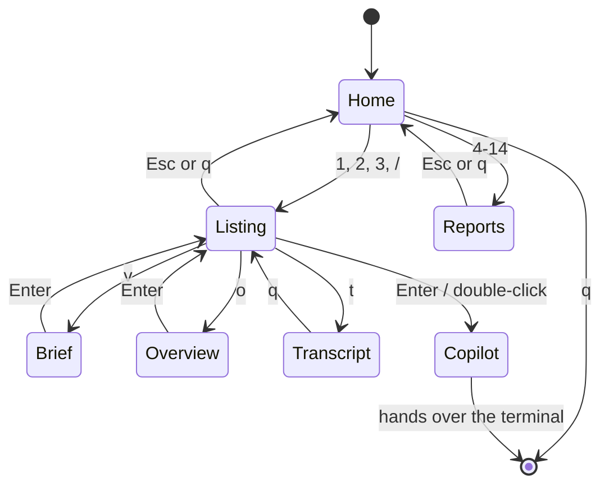
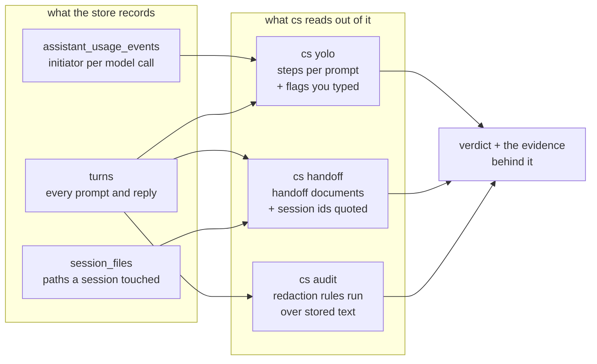

# Guide

Every view, what it shows, and why it shows it that way. For a two-minute
version see [README.md](../README.md); for how the code is put together see
[ARCHITECTURE.md](../ARCHITECTURE.md).

All examples use synthetic data.

---

## 🧭 Interactive mode

Run `cs` with no arguments in a terminal and you get a home screen rather than
a wall of output. It is the home every other view returns to, so nothing is a
dead end.

The menu is always grouped — five short lists you learn the shape of, rather
than nineteen rows you re-read every time. On a shorter window the wordmark
shrinks to pay for the headings, and below about twenty rows it becomes a
single line:

```
                     ██████╗ ██████╗ ██████╗ ██╗██╗      ██████╗ ████████╗
                    ██╔════╝██╔═══██╗██╔══██╗██║██║     ██╔═══██╗╚══██╔══╝
                    ██║     ██║   ██║██████╔╝██║██║     ██║   ██║   ██║
                    ██║     ██║   ██║██╔═══╝ ██║██║     ██║   ██║   ██║
                    ╚██████╗╚██████╔╝██║     ██║███████╗╚██████╔╝   ██║
                     ╚═════╝ ╚═════╝ ╚═╝     ╚═╝╚══════╝ ╚═════╝    ╚═╝
                            S E S S I O N S   B R O W S E R
  420 sessions · 5,120 turns · 12 repos · 11/30 skills · 4/6 agents · 96 sub-agents run · 2 mcp
    activity  ▂▂▁  ▁▃  ▂▂▂▁▂▂▅▂▁  ▂▂▂▂▃▂  ▃▁▂▁  ▂▆▂▄▁ ▁▂▃▃▂▃ ▂▂▄▃▄▂▁ ▅▄▃▂▄▁▂▃▄▄▄▄  ▂▃▅▆▅▂▁▅▄▅▆▄ ▂▅▆▆▃▇▂ ▆▅▃▅▅▂▁▅▆▄▆▆  ▄▆▆▇▄ ▁▅▂▆█▆  ▆ 120 days
  ───────────────────────────────────────────────────────────────────────────
    FIND  ─────────────────────────────────────────────────────────────────
  ▌  🕒  Recent sessions   browse, read and resume · last 7 days
     📚  All sessions      including the quiet and automated ones
     🔍  Search            full text across every turn and checkpoint
    MEASURE  ──────────────────────────────────────────────────────────────
     📦  Repositories      sessions grouped by repository
     📊  Stats             commits, PRs, files and what they cost · last 30 days
     💰  AI spend          credits by model, repository and day · last 30 days
     🔋  Efficiency        cache, rate multiplier, latency, reasoning · last 30 days
     👥  Delegation        you vs the main agent vs sub-agents · last 30 days
    GOVERN  ───────────────────────────────────────────────────────────────
     🚀  Autonomy          which sessions ran unattended · YOLO
     🔗  Handoffs          work passed from one session to the next
     🔐  Security          credentials found in session text
    REFERENCE  ────────────────────────────────────────────────────────────
     🎓  Skills            on disk versus actually referenced
     🤖  Agents            the same, for the agents you defined
     🔌  MCP servers       tool sources wired up, and which were used
     💡  Help              every command and every key
   ↑↓ move · ↵ open · type to find · / search text · q quit
```

**The facts line reads *used over installed*.** `11/30 skills` is not an
inventory count — it is eleven of your thirty skills having actually been
reached for, and nineteen sitting idle. Kit nobody uses is kit that is quietly
rotting, and the gap between the two numbers is the only part worth looking at.
`96 sub-agents run` is counted rather than inferred: every model call the store
bills carries the id of the sub-agent that made it.

**Type to find.** There is no column of numbers, because a numbered menu only
ever reaches its first nine rows and this one has fifteen. Type instead: the
menu narrows as you go, matching the label *and* the description — so `credit`
finds AI spend and `unattended` finds Autonomy. Headings follow their rows, so
a filter down to two options shows the two groups those options live in. Esc
clears what you typed; `q` quits only when nothing is typed, because while a
filter is up every letter belongs to it.

**The strip under the counts is your own history.** One column per day for the
last 120, scaled to the busiest of them, so the shape of the last four months
is on the landing screen before you have opened anything. A day with no
sessions is left blank rather than given the shortest bar — "quiet" and
"barely busy" are different answers, and a chart that cannot tell them apart
is decoration. It is right-aligned, so today is always the last column.

**It draws itself in, once.** On the first screen of a run the wordmark and
the activity strip fill from the left, over about two thirds of a second, and
are then still for as long as you are on the screen. Any key finishes it
immediately; coming back from a view does not replay it. What arrives is the
store's own shape rather than an effect — the screen is telling you how the
last few months went while it opens.

Two details do most of the work. The edge is a **slant**, not a wall: each row
starts two columns after the one above and the activity strip trails them all,
so the header is lit by a single pass across it rather than raised like a
shutter. And the wipe is **eased** — brisk at the start, decelerating into
place, so it arrives rather than stops.

**Each group is drawn in its own hue.** `▌FIND` in the product blue, `▌MEASURE`
in the violet that spend is drawn in everywhere else, `▌GOVERN` in amber
because that block exists to tell you something is wrong, and `▌REFERENCE` in
mint because it is simply there. It is the same accent bar `ui.heading` draws
in every report, so the menu and the page it opens read as one product — the
landing screen used to be the single place in `cs` where a section heading had
no accent at all: four grey words over eighteen rows of grey label, with a
hairline four shades off the background and therefore invisible.

**The menu is grouped, and the wordmark pays for it.** Five captioned blocks
are what make nineteen destinations navigable — "governance is the third
block" is a thing you remember, "Autonomy is the ninth row" is not. So the
headings come first and the wordmark shrinks to afford them: seven rows, then
four, then a single title line. They are dropped only on a window with barely
more menu rows than there are groups (under about twenty), where captions
would be most of what is on screen.

This was the other way round at first — headings only if they cost the
wordmark nothing — and on every window under about forty rows they cost
something, so nobody ever saw a group. The one rule that survived intact is
that the wordmark never *shrinks as the window grows*: a logo that gets
smaller on a bigger terminal reads as a bug however it is explained. The menu
scrolls, so a heading costs a little scrolling at worst, never an option. The
activity strip rides with the wordmark: a window too short for one is too
short for the other.

**Enter opens the highlighted row. Every row, one press.** Four of them —
Stats, AI spend, Efficiency and Delegation — count over a span, and which span
it was is half the answer. So the window is a *setting* on the menu rather
than a question asked after you commit: `←` and `→` step it through 7 days →
30 → 90 → a year → all time, the counting rows caption themselves with it, and
the status line says which one is live.

```
   💰  AI spend          credits by model, repository and day · last 30 days
   🔋  Efficiency        cache, rate multiplier, latency, reasoning · last 30 days

 ↑↓ move · ↵ open · ←→ window 30d · type to find · / search · q quit
```

This used to be a picker that opened *after* Enter and wanted an Enter of its
own, so six rows took two keystrokes to launch and thirteen took one — which
reads as the menu having missed the first press. The window is remembered for
the rest of the run, and **every one of those reports says in its title which
window it counted**: `AI spend · all time`, `Efficiency · last 7 days`.
The same windows work from the shell: `cs cost all`, `cs efficiency 7`,
`cs agents 90`.

### Keys

| Key | On the menu | In a report | In a listing |
|-----|-------------|-------------|--------------|
| `↑` `↓` | move | scroll a line | move the row cursor |
| `Enter` | open | — | resume the session |
| letters | narrow the menu as you type | — | — |
| `space` / `b` | — | page down / up | — |
| `g` / `G` | — | top / bottom | first / last row |
| `←` `→` | step the counting window | re-sort by column | re-sort by column |
| `s` | — | reverse sort | reverse sort |
| `/` | full-text search | — | filter |
| `v` `o` `t` | — | — | session page (`v` and `o` both) · transcript (`t`) |
| `Esc` | clear the filter, then quit | back to the menu | clear filter, then back |
| `q` | quit, when nothing is typed | back to the menu | back to the menu |
| Mouse | click, wheel | wheel scrolls 3 lines | click row, click header, wheel |

`Esc` is **back** everywhere. Reports opened from the menu scroll in place
rather than in `less`, because `less` treats `Esc` as a meta prefix and cannot
return you to the menu. Run the same command from the shell and you get your
own `$PAGER` as usual.



---

## 🔎 Reading a session

Two views, because a session raises two different kinds of question. **What
happened, and is it finished?** is `cs show`. **What exactly was said?** is
`cs read`.

| | Answers | Carries |
|---|---|---|
| 📦 `cs show` (`v`/`o`) | *what happened, and what did it cost?* | what's still open, first and last request, what got done, what shipped — then spend by model, work split, files, **which skills and sub-agents**, risk |
| 📦 `cs show --short` | *just the story* | the top half of the above, and nothing else |
| 💬 `cs read` (`t`) | *what was actually said?* | every turn, 👤 you and 🤖 Copilot, in full |

> There used to be three. `cs brief` judged, `cs show` inventoried, and the
> rule was that no fact appeared in both. The rule was sound; the split was
> not. `brief` answered *what happened* and `show` answered *what it cost*,
> and nobody ever wanted one without the other — so every `brief` was
> followed by a `show`, which is the behaviour of a view that stops too
> early rather than one that is deliberately small. They are one page now.
> `cs brief` still works: it is `cs show --short`.

Both open with the same header, so moving between them never means
re-reading it to find out that nothing changed:

```
  ── Migrate CI to GitHub Actions ──────────────────────────────────────

  repo     acme/infra  ·  main
  dir      work/acme/infra
  span     2026-03-06 09:12 → 2026-03-09 17:03
  volume   13 turns · 4.2k AIU
```

…and close with where to go next, saying what each of those gives you rather
than just what you may type:

```
  ─────────────────────────────────────────────────────────────────────
  id       a1b2c3d4-1111-4222-8333-444455556666
  next     cs read a1b2c3d4    the conversation itself, both sides
           cs resume a1b2c3d4  reopen it in Copilot CLI
           cs show a1b2c3d4    the full page: spend, files, skills, turns
```

The last row appears only after `--short`, because a page that has stopped
early owes you the fact that it stopped. The full page has nothing left to
point at, so it doesn't.

The `id` row carries the whole uuid for copying; the commands use the short
form, which is just an unambiguous prefix and works anywhere an id does.

### 📦 `cs show` — the session, whole

Reopening a long session to remember where it got to is the slow way.
`cs show` reads it for you. It opens with the story, ordered by what you act
on:

```
  Still open
    → Immediate (in-flight): wire the deploy job to the staging environment.
    → Confirm the release tag convention: `git tag --list 'v*' | tail -3`

  First request · turn 0
    migrate the existing build jobs to github actions — review how the
    current deployment works first, then port it step by step …

  What got done
    · Pushed and green on `acme/infra`, PR #128
      (`feat/actions-migration`), head `1a2b3c4`

  Last request · turn 12
    why is the gateway job still using the old runner …

  Shipped
    commits  1a2b3c4, 5d6e7f8
    PRs      #128
```

**Still open** leads because it is the only section that changes what you do
next. Everything after it is the session's own story in order: what was asked
for, what came of it, where you left off — and *Last request* is last because
it is the one that hands you to `cs resume`.

*First request* is named for what it is. It was headed "Goal", but it is
literally the opening prompt, and an opening prompt is often housekeeping the
session then moved on from.

Nothing is truncated — items wrap with a hanging indent, and hyphens are never
break points, so `--format='%an'` stays copyable. Sessions without a checkpoint
fall back to the closing reply for the outcome, with any markdown tables in it
flattened to prose rather than printed as rows of pipes.

Add `--asks` to list every request in the session, in order and in full. The
footer offers it only when there is more to see than the two requests already
printed.

Stop here with `cs show --short` (or `cs brief`, the same thing) when the
story is all you wanted. It also skips six queries, which is the difference
between instant and nearly instant on a session with a thousand turns.

#### …and then the receipts

The same page continues into the inventory: spend by model, who did the work,
files touched, risk — and **which skills and sub-agents were involved**, each
with the grounds for saying so.

```
  ▌Skills & agents
    skill okr-planning  ran  turn 1
    skill deploy-check  named  turn 14
          we should run the deploy-check skill before shipping this
    1 loaded by the CLI itself — that much is recorded, not inferred.
    Anything marked 'named' was only mentioned in the text, so the quote
    is the whole of the evidence.

    agent d1B9dH  turn 1   claude-opus-4.8   25 calls   258 AIU   8m
    Counted from the billing records, not inferred. The store keeps no
    name for a sub-agent — only the id of the call that launched it — so
    they are named by what they ran and spent.
```

Three different kinds of evidence share this block, so they are drawn three
different ways rather than being flattened into one confident-looking list:

- **`ran`** — the CLI's own `<skill-context>` marker. A record.
- **`named`** — a qualified mention in the transcript, printed *with the
  sentence it was read from* so you can spot a false positive yourself. An
  inference is worth exactly as much as your ability to check it.
- **sub-agents** — counted from the billing records, which is exact. The store
  keeps **no name** for a sub-agent, only the id of the call that launched it,
  so `cs` identifies them the one honest way available: the model they ran on,
  the turn they were launched from, their calls, spend and wall time. That is
  enough to tell a cheap lookup from a twenty-minute research run, which is the
  distinction a reviewer actually needs.

Both also travel: `cs export <#N>` puts the same table at the top of the
Markdown document, and `cs export <#N> --json` emits names, evidence and
per-agent spend as data.

### 💬 `cs read` — the whole conversation

Every turn in full, both sides, wrapped to your terminal and piped through your
pager, so `/` searches the transcript.

```bash
cs read #3              # the whole conversation
cs read #3 --turn 12    # just that turn
cs transcript #3        # 'transcript' is an alias for 'read'
```

Each side of the conversation is marked with who is speaking — 👤 for you,
🤖 for Copilot — so finding your own last question in a fifty-turn session is a
glance rather than a read. `CS_GLYPHS=ascii` swaps them for `>` and `*` on
terminals that would draw hollow boxes instead — and does the same for the
landing screen's icons, which used to ignore it.

Every icon `cs` draws is from the original Unicode 6.0 emoji set that every
emoji font has shipped since 2010. That is a deliberate constraint: the Hooks
row once used U+1FA9D, added in 2020, and any terminal whose font predated it
drew a blank — so that row read as the one option on the menu that forgot its
icon. A missing glyph looks like a bug in the tool rather than a gap in a
font, which is why the suite rejects a newer codepoint rather than trusting
whoever adds the next row to know the difference.

Lists keep their hanging indent, tables become aligned columns instead of raw
`| pipes |`, and indented code is never reflowed. Every turn rule carries its
ask, so scrolling tells you *what* you are looking at rather than how far in
you are.

There is no contents list here, and there is none on `cs show` either. A
table of contents you have just read is only distance from the text, and the
one `cs show` used to print was a third rendering of a list that page already
shows the ends of — first request, last request — and that `cs show --asks`
shows entire. The turn numbers are on the rules here; `cs show --asks` is the
numbered list, and it tells you the `--turn N` command to open one.

### 🔍 `cs search` — reaches everything, ranked

Runs against the store's full-text index, so it covers **both sides of every
turn** plus checkpoints and workspace artifacts — not just summaries.

```bash
cs search cache tokens          # several words are one query
cs search 'portal AND charts'   # FTS5 operators
cs search '"an exact phrase"'   # phrases
cs search three.js              # punctuation FTS5 rejects — retried for you
```

```
  Search · 'cache tokens' · 8 sessions · best match first

    1  03-08T11:20   24        -   Tune search relevance   #acme/webshop
       turn …cache_read + cache_write · cache_write + output…
    2  03-05T19:31   23     4.4k   Refactor cart service   #acme/webshop
       turn …each `assistant` message carries a `usage` block…
```

### 📁 `cs files` — from a file back to the work

```bash
cs files cli.py         # sessions that touched cli.py
cs files 'src/*.py'     # wildcards, matched against the tail of the path
```

Results are annotated `create` or `edit`. `cs show` lists a session's files too
(`+` created, `~` edited).

---

## 📈 Measuring the work

### 📊 `cs stats` — the output ledger

```
  ▌What it produced
  commits  120 recorded (118 distinct)
  PRs      50 recorded (39 distinct)
  files    2,184 created · 618 edited
  handoffs 223 checkpoints written

  ▌What it cost
  credits  340.7k AIU
  tokens   3.0B in · 19.9M out · 6.4M reasoning
  cache    2.8B read (49% of tokens sent)
  time     81.3h of model time

  ▌How it was done
  agents   4,634 sub-agent calls over 374 delegated tasks
  context  151 re-summarisations

  ▌Where it landed
    refs  repository                     share            sessions
      49  acme/webshop                   ████████████████▏······       26
      40  acme/infra                     █████████████··········        6
```

Commits and PRs come from what Copilot recorded per session, so they count what
the **sessions** produced, not your whole git history.

### 👥 `cs agents` — who actually did the work

Every recorded model call is tagged with what initiated it, so delegation and
context churn are measurable rather than guessed.

```
  ▌Who initiated the work
    main agent   ██████████████████ 19,937 calls   198.4k AIU  58% · 423 sessions
    you          █                   2,075 calls    68.2k AIU  20% · 426 sessions
    sub-agents   ████                4,634 calls    36.3k AIU  11% ·  97 sessions
    compaction                          151 calls    19.7k AIU   6% ·  54 sessions
```

**"Tasks", not "agents".** `agent_id` in the store is the delegating tool-call
id, unique to one session, so it counts *delegations*. No agent name is
recorded anywhere, which is why `cs` never invents one: `cs show` identifies
each sub-agent by the model it ran on, its calls, its spend and the turn it was
launched from. Named *skill* usage comes from `cs skills` / `cs profiles`.

### 💰 `cs cost` — what the work actually spent

```
  ▌By model
       spend  model                   share                   calls    avg  first
      117.3k  claude-opus-5           ██████████████████     10,906  11.5s   4.3s
       31.1k  claude-sonnet-4.6       ████                    1,552   5.8s   4.0s
        6.1k  gpt-5.5                                           777  13.0s   6.3s

  ▌Per day
       spend  day                     share                   calls
       46.8k  Fri 06 Mar              ██████████████████      4,412
       28.4k  Sat 07 Mar              ███████████             2,610
```

Each breakdown shares one column shape, named once in a header line, and the
bar — the only variable-width field — always goes last, which is what keeps the
columns still.

#### What a credit total actually covers

A session's spend is its **whole life**: every call the store ever billed to
that session id, across every time it was resumed, with compaction and
sub-agents counted in. `cs show` splits it so the total is not a mystery:

```
  ▌How the work was done
    you        ▍·················    20 calls       699 AIU
    main agent ██████████████████   949 calls      7.3k AIU
    sub-agents ▊·················    42 calls       326 AIU
    compaction ▏·················     6 calls       710 AIU
    delegated  2 tasks handed to sub-agents
    indirect   1.0k AIU · 11% of spend, no prompt behind it
```

`indirect` is the slice with no prompt of yours behind it — context being
re-summarised, and agents you delegated to. On a long session it is routinely
a tenth of the bill, and it is the reason `cs` reads higher than the running
total in Copilot CLI's own status line, which counts only the run you are
sitting in. Your plan's usage is account-wide and server-side, so it matches
neither. Run `cs show <id> --why` to have that said on the page.

### 🔋 `cs efficiency` — whether it had to cost that

`cs cost` says what you spent. This says whether it needed to be that much.
Four readings, each one a lever somebody can actually pull:

```
  ▌Cache
  hit rate 48%  █████████████▌··············
  tokens   49.2M read from cache · 1.4M written to it · 51.3M sent fresh

  ▌Rate multiplier
       spend  multiplier              share                            calls
        2.8k  15× · 73% of spend      ███████████████████████████        374
        1.0k  1× · 27% of spend       █████████▉·················        259

  ▌First token
  p50      3.3s  half of calls answer faster
  p95      7.6s  the slow tail, over 632 calls

  ▌Reasoning
  share    21% of output tokens were reasoning (63.5k)
  effort   medium 246 · xhigh 181 · high 165 · max 40 · (default) 1

  ▌By model
       spend  model                   share                calls cache first
        2.6k  claude-opus-5           ███████████████        350   48%  4.1s
```

| Reading | Why it is the one worth watching |
|---------|----------------------------------|
| **Cache hit rate** | `cache_read / (fresh + cache_read + cache_write)`, the definition the published agent-telemetry schemas use. Cached input is the cheapest input there is, and on a long session its share is the single biggest lever on the bill. A rate that falls over a week usually means something near the top of the context is churning. |
| **Rate multiplier** | Every call is billed at a rate. A premium multiplier earning its keep on hard work is money well spent; the same multiplier on lookups and file reads is the most common way a bill runs away without anyone having decided that it should. |
| **First token (p50/p95)** | Quoted the way latency is quoted everywhere else — the middle and the bad end — because the mean hides exactly the tail that makes a tool feel slow. |
| **Reasoning share** | Reasoning tokens are output tokens you pay for and never read. Worth it on genuinely hard work; on routine edits a lower effort setting buys the same answer for less. |

It also lists any finish reasons that were not a clean stop, because a call
that ended on a length limit or a filter is spend that bought nothing.

Every block is independent, and a store that does not record a column simply
does not get that block — an absent reading is left absent rather than shown
as zero.

### 🎓 `cs skills` / 🤖 `cs profiles` — configured versus used

```
  configured 30
  referenced 11 appear in at least one session
  loaded      7 were actually run by the CLI
  idle       19 never referenced

  ▌Most referenced skills
      18  deploy-check     ████████████████ · 12 ran
      15  commit           █████████████    ·  9 ran
       9  release-notes    ████████
```

**Two claims, and they are not the same claim.** `cs` is careful to keep them
apart everywhere it reports skill usage:

| | Evidence | Strength |
|---|---|---|
| **ran** | The CLI writes `<skill-context name="…">` into the turn when it loads a skill. That marker is written by the tool, *because* the skill ran. | A record |
| **named** | The session's text mentioned the skill in a qualified way — its path (`skills/commit`), its filename (`commit.skill.md`), or the word "skill"/"agent" beside the name. | An inference |

The inference is **deliberately conservative** and undercounts on purpose: a
bare word match is worthless when skills are called `commit`, `plan` or
`status`. A number that is too high is worse than one that is careful.

Only skills leave a load marker, so `cs profiles` reports references alone and
never claims a profile ran.

### 📋 `cs instructions` — what the agent is told before you type

```
  ── Instructions · 4 on disk ─────────────────────────────────────────────────

  project  2 files · 133 chars
           ~/work/acme/portal
  personal 2 files · 5,522 chars
           ~/.copilot
  limit    4,000 chars per file before Copilot truncates

  ▌Loaded before your first prompt · 4 ────────────────────────────────────────
    scope    file                             chars  lines  headings
    ─────────────────────────────────────────────────────────────────────────
    personal AGENTS.md                        5,478    133         1
    project  .github/copilot-instructions.md     67      8         3

  ▌Not read as written · 1 ────────────────────────────────────────────────────
    ● personal AGENTS.md
      → 5,478 characters — the last 1,478 are past the limit and are not read.

    Move the scoped rules into .github/instructions/*.instructions.md, which
    load only when they match.
```

The faults get a section of their own rather than floating under the table,
and the remedy is printed once for the group — a checkout with three long
files used to repeat the same twenty-word fix three times.

Every other inventory in `cs` reports **configured versus used**. This one
cannot, and that is the point: nothing *references* an instruction file, because
it is loaded before your first word. Every session got all of it that fit — so
the only question worth asking is how much fit.

Two faults are named, and only two, because they are the ones that change what
the model actually reads:

| Fault | Why it matters |
|---|---|
| **Over the limit** | Copilot truncates an instruction file past 4,000 characters. The end of a long `AGENTS.md` is not being read at all, and nothing tells you. The fix is `.github/instructions/*.instructions.md`, which load only when they match. |
| **Long and unsectioned** | Over 60 lines with no `##` headings. A model skims structure the same way you do; a wall gets read as one topic. |

Both scopes are shown: the repository's files, which your colleagues also get,
and your personal ones under `$COPILOT_HOME`, which follow you everywhere and
are the ones that quietly grow past the limit.

Read from disk, never from the store — this is the setup your *next* session
starts from, whatever the last one did.

### 🔔 `cs hooks` — what runs around a session

> **What this adds over `copilot plugins list`.** It resolves every hook
> command against the disk and names the ones whose script is gone — see
> [Every view earns its place](#-every-view-earns-its-place).

Skills and profiles are files a session may *reach for*. Hooks are the
opposite: they fire on the lifecycle whether anyone asks or not, and the
session store records none of it. So `cs hooks` reads configuration rather
than history, and says so.

```
  ── Hooks · 29 commands ──────────────────────────────────────────────────────

  files    4 declaring 29 commands
  events   13 of the 13 cs knows
  scope    29 personal · 0 from this workspace
  missing  1 point at a script that is not on disk

  ▌When they run · 13 ─────────────────────────────────────────────────────────
        3  sessionStart           █████████
        2  userPromptSubmitted    ██████
        4  preToolUse             ████████████

  ▌Scripts that are gone · 1 ──────────────────────────────────────────────────
    Copilot will still run these, and the shell will fail.
    /opt/nope/guard.sh
      preToolUse · gone.json

  ▌Every hook · 29 ────────────────────────────────────────────────────────────
    when                tool     runs                              from
    ─────────────────────────────────────────────────────────────────────────
    sessionStart        ·        REFLECT_HARNESS=copilot uv run …  reflect.json
    preToolUse          Bash     npx cc-safety-net hook            safety.json
```

With no hooks configured at all, the report says where it looked instead —
scope first, in its own column, and the path wrapped after a `/` rather than
elided, because half a path is not somewhere you can put a file.

Events are listed in **lifecycle order**, not by count: a hook list is a
picture of what happens to a session, and alphabetical is a picture of
nothing. `preToolUse` and `PreToolUse` are folded together — one event
written two ways.

Four things it will tell you that reading the JSON yourself will not:

- **a script that has gone missing** — the hook still fires, and the shell
  still fails, quietly, on every session start
- **a hook file that does not parse** — invalid JSON runs *nothing*, and
  silence is exactly the wrong report for that
- **hooks switched off rather than deleted** — a `hooks.off` directory
  explains an empty report that would otherwise look like a bug
- **an event `cs` does not recognise** — marked `?`, because a typo in an
  event name is a hook that never runs

`cs hooks <event>` shows one event with every command in full. Commands are
masked like every other view: a hook command is a shell line, and shell lines
are where an exported token ends up.

It reads `$COPILOT_HOME/hooks/*.json`, `$COPILOT_HOME/settings.json`, and the
same two under `./.copilot/` — in the order Copilot loads them. Nothing here
executes a hook or writes to a hook file.

### 🔌 `cs mcp` — the tools that are not Copilot's own

Skills are files the model may read; hooks are commands that fire on the
lifecycle. MCP servers are the third thing a session starts with, and the only
one that reaches **outside the machine**: a process spawned on your box, or an
HTTP endpoint somewhere else, either of which can be handed the conversation.

```
  ── MCP servers · 2 ──────────────────────────────────────────────────────────

  files    1 declaring 2 servers
  type     1 local · 1 remote
  scope    2 personal · 0 from this workspace
  tools    2 of 2 expose everything the server offers

  ▌Every server · 2 ───────────────────────────────────────────────────────────
    server     transport runs                      tools  sessions  from
    ─────────────────────────────────────────────────────────────────────────
    atlassian  http      mcp.atlassian.com/v1/mcp    all         5  pers:mcp-config
    snyk       local     snyk mcp -t stdio           all         1  pers:mcp-config
```

The name column takes what the longest name needs rather than a flat twenty,
and `https://` is dropped from every endpoint — eight columns of the same
eight characters on every row, which were pushing the host off the end.

Local versus remote is the first line, because it is the only one that says
whether the conversation leaves this machine. Four things it will tell you
that reading the JSON yourself will not:

- **a credential written into the config** — a literal value where `${VAR}`
  belongs is a token sitting in a file that gets committed. The *key* is
  named; the value never is
- **a command that is not on this machine** — Copilot still tries to start
  the server, and the spawn still fails
- **a server allowed every tool** — `"tools": ["*"]` is the default a wizard
  writes, and it enables whatever the server adds next without anyone deciding
- **a config parked rather than deleted** — an `mcp-config.json.bak` explains
  an empty report that would otherwise look like a bug

The session counts are the same kind of signal as `cs skills`: the store
records no MCP invocation event either, so they come from qualified mentions
in the transcript — a tool named `mcp__atlassian__search`, or the server named
as a server. A bare `notion` never counts.

`cs mcp <name>` shows one server in full, with the sessions that named it.
It reads `$COPILOT_HOME/mcp-config.json`, `./.copilot/mcp-config.json`,
`./.mcp.json` and `./.vscode/mcp.json` — the first file to declare a name
wins, the way Copilot resolves it. URLs are printed without their query
string, because an MCP endpoint is routinely handed its token that way and a
report that prints one has created the problem it was checking for. Nothing
here starts a server or writes to a config file.

---

## 🎯 Getting better at it

Every other view answers *what happened*. These three answer **how the work is
being done** — and they are the only views in `cs` that will tell you something
about yourself rather than about a session.

> **Unlisted.** All three are off the menu and out of `cs help`, and all three
> still run when typed. Nothing about them was deleted — see
> [Every view earns its place](#-every-view-earns-its-place).

### `cs coach` — habits, scored, worst first

Twenty-two rules read a window of the store and report the habits they can
actually see, each with the sample it was drawn from and three real examples.

```
  ── Practice · last 30 days · 420 sessions ──────────────────────────

  read     420 sessions · 3,180 turns
  calls    24,600 to the models
  found    9 habits · 1 high · 4 medium · 4 low

  ▌Scores
      77  prompt quality    ███████████████▍····
      60  session hygiene   ████████████········
      62  model & spend     ████████▍···········
      84  review habits     ████████████████▊···

  ▌What to change · 9

    ● high   Sessions that never ended          session hygiene        7/210
      7 sessions ran past 50 turns
      → Past a few dozen turns the early context is compacted away and the
        model is working from a summary of a summary. Close the session, write
        a handoff, open a fresh one — 'cs handoff' shows who does.
        a1b2c3d4  96 turns · Refactor cart service
        b2c3d4e5  74 turns · Migrate CI to GitHub Actions
        c3d4e5f6  61 turns · Add checkout validation
```

Four rules about how the design holds up under scrutiny:

- **Every finding carries its evidence.** A habit you cannot see an example of
  is not a finding, it is an accusation.
- **Every score is recomputable.** A group starts at 100 and each finding costs
  its severity — high 25, medium 15, low 8. Nothing else moves the number, so
  the list underneath *is* the calculation.
- **Rules stay quiet below their sample.** Silence means "not enough to say",
  never "nothing to find", and the footer says so rather than letting an empty
  report read as a clean bill of health.
- **Scheduled runs are excluded.** Prefixes in `.cs-ignore` are skipped, and
  harness-injected blocks (`<system-reminder>`, skill preambles) are stripped
  before a prompt is judged — otherwise the review reviews the harness.

The rules lean on store columns nothing else in `cs` reads: `duration_ms`,
`finish_reason`, `cache_read_tokens`, `reasoning_effort` and `turns.timestamp`.
Each is optional, and a rule whose column is missing simply never fires.

### `cs rhythm` — when the work actually happens

Description, not judgement. Two people with identical histograms can be working
perfectly well and heading for a wall respectively, and this report does not
pretend to know which.

```
  ── Rhythm · last 30 days ───────────────────────────────────────────

  turns    3,180 on 30 working days
  span     2026-02-08 → 2026-03-09
  streak   12 days, back to back
  busiest  2026-02-24 · 168 turns
  late     286 turns 22:00–05:00 (9%)
  weekend  191 turns Sat/Sun (6%)
  slowest  14s median · 58s p90

  ▌Hour of day
    09   ████████████████████████████ 148
    10   ██████████████████████████████████████ 201
    11   ████████████████████████████████████████████ 236
    14   ██████████████████████████████████████████████████████ 289
    22 · ███████ 38
```

Times are **local**, converted from the UTC the store writes. Night hours are
marked with `·` rather than coloured red: making the block visible is useful,
calling it bad is not this report's job. The window cuts by the **turn**, not
the session — a session touched yesterday may have opened in March, and its
March evenings do not belong in this month's histogram.

### `cs context` — what the repo hands the agent

The only view that reads disk instead of the store: the instruction files,
prompts, skills, agent profiles and hooks loaded *before* your first word.

```
  project  3 instructions
  personal 6 agents · 2 instructions · 14 skills
  hooks    0 commands on the lifecycle

  ▌Gaps · 3
    ● medium project AGENTS.md is 5,920 characters
      → Copilot truncates an instruction file past 4,000 characters, so the
        end of this one is not being read. Move the scoped rules into
        .github/instructions/*.instructions.md, which load only when they
        match.
```

It checks two scopes — **personal** (`$COPILOT_HOME`, which follows you between
repositories) and **project** (the working directory, which your colleagues get
too) — and reports only gaps that change what the agent sees on the very next
session. A checklist long enough to ignore is a checklist that gets ignored.

---

## 🛡️ Governance

Once an agent has been writing code for a month, three questions arrive that no
single session can answer: **did it run unattended**, **was the work handed
on**, and **is there a credential sitting in a transcript**. The store has no
column for any of them, so `cs` reads each out of what *is* recorded, and
prints the evidence next to the verdict.



### 🚀 Autonomy — `cs yolo`

```bash
cs yolo            # sessions that ran unattended
cs yolo --all      # including the supervised ones
```

```
  ── Autonomy · 420 sessions scanned ──────────────────────────────────────────

  ● APPROVALS WERE TURNED OFF
    24 sessions of 420 ran with nobody approving each step · 6 with approvals
    off outright

        6  YOLO        ▏········· approvals off, on the evidence of the session
       18  unattended  ▍········· no evidence either way, but it ran unattended
      396  supervised  █████████▌ prompted often enough to be supervised

  ▌Approvals off · 6 ──────────────────────────────────────────────────────────
    You turned approvals off yourself.

    last active  session   turns  steps  per turn  evidence          summary
    ─────────────────────────────────────────────────────────────────────────
    03-04 21:31  9c0d1e2f      2    116      58.0  typed in session  Bulk-rename…
    03-02 11:04  1f2e3d4c      7    136      19.4  --allow-all-tools Port the ad…

  ▌Ran unattended · 18 ────────────────────────────────────────────────────────
    No flag either way — these ran too far between prompts for anyone to have
    been watching.

    last active  session   turns  steps  per turn  summary
    ─────────────────────────────────────────────────────────────────────────
    03-09 16:09  3a4b5c6d      1     98      98.0  Regenerate API clients
```

The verdict is the section a session is filed under, so it is stated once per
group rather than repeated in a column and again on a line of its own beneath
every row. Two different claims, kept apart on purpose:

- **YOLO** means the session itself shows approvals were off — you passed
  `--allow-all-tools`, or typed `yolo` to turn it on. Only *your* messages
  count: the store is full of the agent explaining what the flag does, which is
  not the same as using it.
- **unattended** is inferred, and says so. `initiator` on every model call
  separates prompts you sent from steps the agent took on its own, so *steps
  per prompt* measures directly how far a session ran between check-ins.

Everything else is **supervised** and hidden by default.

### 🔗 Handoffs — `cs handoff`

```bash
cs handoff             # every session that wrote or read a handoff
cs handoff e5f6a7b8    # the chain that one belongs to
```

A handoff is a document one session leaves so the next can carry on. Nothing in
the store links the two sessions, but the document does — both opened it, and
`session_files` records that.

| Role | Meaning |
|------|---------|
| `emitted` | wrote a handoff for whoever came next |
| `received` | picked the work up from one |
| `both` | took one up and left another |
| `touched` | opened a handoff document without saying which way |

```
  ○ 2026-03-02 21:51  Plan the payments migration
    7e8f9a0b · 38 turns
    ├─ ● 2026-03-04 20:39  Port the payment adapters
    │  e5f6a7b8 · 63 turns · session id referenced
    └─ ○ 2026-03-06 10:46  Verify payment parity
       b4c5d6e7 ·  4 turns · session id referenced
```

Links are **evidence, not similarity**: two sessions that opened the same
handoff file, or one that quotes another's id. A session with no links says it
stands alone rather than inventing a parent.

### 🔐 Security — `cs audit`

```bash
cs audit               # every session holding credential-shaped text
cs audit a1b2c3d4      # just one
```

Masking hides a secret on screen but leaves it in the store, and leaves you
unaware it is there. `cs audit` runs the same rules over the whole store to
answer the question masking cannot: **which conversations hold a credential at
all.**

It looks in three places, because a session can hold one in three ways:

| Where | What it is | Why it needs its own pass |
|---|---|---|
| Turns | what you typed, what Copilot replied | the obvious one |
| Checkpoints | prose the agent saved about the work | a separate table that *outlives the turns* |
| Sensitive paths | `.env`, `id_rsa`, `.aws/credentials`, `*.pem`, `*.tfstate` | `session_files` proves the path was created or edited, not that its contents were read |

And it answers a fourth question that is not about credentials at all — **what
did the session take away**. See [Destructive
actions](#destructive-actions) below.

```
  ── Security · 420 sessions scanned ──────────────────────────────────────────

  ● ACTION REQUIRED
    3 sessions need your action · 6 values pasted by you
    24 findings across 11 sessions. Rotate confirmed live credentials first.

        2  CRITICAL  █▏······· confirmed key format
        1  HIGH      ▌········ token or URL login
       21  REVIEW    ████████▊ named assignment

  ▌Immediate action · pasted by you · 3 ───────────────────────────────────────

    risk     session   found  turn  finding      summary
    ─────────────────────────────────────────────────────────────────────────
    critical a1b2c3d4      4     3  AKIA…, token Provision the staging stack
      └ …a documented `[redacted:aws-key-id]` in the bootstrap script…
    review   e5f6a7b8      4    24  DB_PASSWORD  Wire the reporting database
      └ … `DB_PASSWORD=[redacted]` reported CLEAN by the scanner…

    cs read <session> --turn <turn> — open the exact turn above
```

- **`risk` is certainty, not value.** `cs` can tell how sure it is that
  something *is* a credential; it cannot know what the credential opens.
  `critical` is a documented key format and can be nothing else; `review` is a
  value on a password-ish name, which is credible but is sometimes prose.
  Sorted worst-first, so the rows that matter are not buried under guesses.
- **`hardcoded` is the one exception**, and it is not a certainty at all — it
  is what was *done* with the value. A finding is called hardcoded when both
  halves of the evidence are in: the line reads as source rather than prose
  (`API_PASSWORD = "…"`, `export TOKEN=…`, a quoted JSON value — never
  `the token: …` in a sentence), **and** `session_files` shows the session
  created or edited a file. Neither half alone counts: a code snippet in a
  session that wrote nothing was discussed, and a session that wrote files
  whose finding is a sentence is a password talked about. A hardcoded row
  sorts half a step above its own severity, so twenty-two of them are not
  buried under ninety mentions of the same certainty — but never above a
  `critical`, which is still the more certain claim.
- **`Immediate action`** is the group to act on: a secret you pasted is in the
  transcript, and the transcript is on disk in the clear. Rotate it, then find
  where else it went.
- **`Assistant output`** means the value appeared in a Copilot reply — file
  content, an example, or generated text. Inspect the turn before deciding.
- **`Saved checkpoints`** is the group people are most surprised by: clearing a
  conversation does not clear its checkpoint. A checkpoint has no turn to open,
  so that section offers `cs show <session>` instead of a `--turn`.
- **The evidence hangs off the row**, masked, and the command that opens it is
  named once under each table. It used to ride every row as
  `inspect cs read <id> --turn <n>` — the same boilerplate forty times over,
  whose only two variables are already columns of the row above it.
- The report prints a **name** (`DB_PASSWORD`) or a **public prefix** (`ghp_…`),
  never a value. An audit that printed the secret would have leaked it somewhere
  new.

<a id="destructive-actions"></a>
#### Destructive actions

Credentials are what a session *left behind*. This is what it **took away** —
files removed, history rewritten, a database dropped, infrastructure torn
down, permissions widened, code run straight off the network.

This is the **first** block on the page, and it is named in the lead, because
it is the only thing here that rotating a value cannot undo:

```
  ● ACTION REQUIRED
    9 sessions need your action · 14 values pasted by you · 22 hardcoded in
    sessions that wrote files · 1 session reports destroying something

  ▌Destructive actions · 75 ───────────────────────────────────────────────────
    Read out of the conversation. The store records file creates and edits but
    no deletion, and no command exit code — so nothing here is proof that
    something ran.

        1  ran       ▏········· the session reports having done it
       74  proposed  █████████▉ offered in a code block; the store cannot say…

  ▌Reported as done · 1 ───────────────────────────────────────────────────────
    last active  session    turn  seen  what     summary
    ─────────────────────────────────────────────────────────────────────────
    06-28 16:24  c08fec16      1     2  delete   RunOps migration
      └ git rm -r runops` staged in `integration-control-tower` repo (30 file…
```

The two tiers are printed at **two ends of the report**, not together. What a
session says it did leads; what it merely offered goes to the foot, under
`Offered, outcome unknown`, because it is both the least certain material on
the page and much the longest — seventy-four rows of "the store cannot say"
between the urgent findings and the credentials buries both of them.

**The store has no delete event and no exit code.** `session_files.tool_name`
records `create` and `edit` and nothing else; `forge_trajectory_events`, which
would carry a command and its exit code first-hand, is read when it has rows
and is empty in most stores. So a removal can only be found where it was
written down — in the conversation — and the report says so above the table
rather than dressing the inference up as a fact. This is the same honesty
`cs yolo` applies to approval mode.

That is why the split into two tiers matters more than the list itself:

| Basis | What it means | How it is decided |
|---|---|---|
| `ran` | the session reports having done it | the command is **not** inside a ``` block, and a completion word (`deleted`, `staged`, `✓`) sits within a few dozen characters of it, with no negation in between |
| `proposed` | offered; the outcome is not recorded anywhere | everything else — including every destructive command in a fenced block, and every one **you** typed, because an instruction is not an outcome however you phrase it |

The proximity window and the negation guard are what make the first tier worth
reading. "their blobs were committed in earlier commits, so `git filter-repo`
+ force-push is destructive and I didn't do it" carries a completion word on
the same line as the command it explicitly declines to run; a marker anywhere
on the line would have called that done.

The kinds, worst first: `history` (force-push, `reset --hard`, `filter-repo`),
`data` (`DROP`, `TRUNCATE`, an unqualified `DELETE FROM`), `infra`
(`terraform destroy`, `kubectl delete`, `docker volume rm`), `delete`
(`rm -rf`, `git rm`, `find -delete`, `shutil.rmtree`), `network`
(`curl … | sh`), `sudo` (`chmod 777`, `chown -R`, `sudo`).

`cs show` carries the same readings for a single session, and only when there
is something to say:

```
  ▌Risk & continuity
    YOLO       you passed --allow-all-tools
    destroyed  delete, history · reported done · cs read c08fec16 --turn 1
    secrets    4 found · you typed it · AKIA…, token
```

---

## 🔐 Credential masking

Sessions record whatever was typed or echoed. `cs` masks it **at the render
edge**, so nothing credential-shaped reaches your screen:

```
  AKIA…EXAMPLE → [redacted:aws-key-id]
  ghp_…        → [redacted:github-token]
  postgres://admin:[redacted]@db/app
```

<details>
<summary>The credential formats it recognises</summary>

**Documented key shapes**, which can only ever be credentials:

`AKIA…`/`ASIA…` (AWS) · `ghp_`/`gho_`/`ghu_`/`ghs_`/`ghr_` and `github_pat_`
(GitHub) · `glpat-` (GitLab) · `xoxb-`/`xoxp-` and `hooks.slack.com/services/…`
(Slack) · `AIza…` and `GOCSPX-` (Google) · `sk-`/`sk-ant-`/`sk-proj-` (OpenAI,
Anthropic) · `sk_live_`/`rk_test_` (Stripe) · `npm_` · `pypi-` · `hf_`
(Hugging Face) · `dapi…` (Databricks) · `SG.…` (SendGrid) · `sig=` and
`AccountKey=` (Azure SAS and storage) · PEM and PGP private-key blocks

**Credential-carrying shapes**, which usually are:

JWTs (`eyJ…`) · `Authorization: Bearer …` · `Authorization: Basic …` ·
credentials embedded in URLs

**And the general case** — a value assigned to a name that means a credential:
`password`, `pwd`, `secret`, `token`, `api_key`, `access_key`, `account_key`,
`sas_token`, `client_secret`, `auth_token`, `private_key`, `credential`,
`connection_string` — including inside a longer identifier (`DB_PASSWORD`,
`spring.datasource.password`, `appsecret`).

**Deliberately not masked:** bare numbers and placeholders. AI sessions discuss
tokens constantly, so `max_tokens = 4096`, `api_key: ${API_KEY}` and
`secret: null` are left exactly as they are.

</details>

Set `CS_REDACT=0` when you genuinely need the raw value back — it is your own
machine, and every view tells you masking is on.

---

## ⚙️ Configuration

| Setting | How |
|---------|-----|
| 📂 **Store location** | Set `COPILOT_HOME` if your Copilot data isn't in `~/.copilot` |
| 📄 **Pager** | `brief`, `show` and `read` honour `$PAGER` (default `less -R -F -X`, plus `--mouse` on less 551+) |
| 🙈 **Hide automated sessions** | Add summary prefixes, one per line, to `$COPILOT_HOME/.cs-ignore` |
| 👁️ **Show everything** | `cs all` drops the date window and your ignore file; sessions that recorded nothing at all are never listed |
| 🔓 **Show raw secrets** | `CS_REDACT=0` disables credential masking for one command |
| 🔣 **Plain glyphs** | `CS_GLYPHS=ascii` replaces every emoji — the 👤/🤖 speaker marks *and* the landing screen's icons — with plain markers, for terminals that would draw hollow boxes |
| 🎨 **Theme** | Colours are tuned for a dark terminal; `CS_THEME=light` restores the pastel palette for a light one |

By default `cs` hides **empty** (zero-turn) sessions so the list stays useful.
Scheduled runs can be hidden by prefix:

```
# ~/.copilot/.cs-ignore
Run the nightly pipeline
Weekly roundup
```

### The look of it

Every view is drawn from one small set of primitives in `ui.py`, and a change
to any of them changes the whole product at once. If you are adding a view,
these are the rules it should already obey.

**Hue carries meaning, brightness carries emphasis.** The palette is one axis —
the Copilot purple→cyan — plus two warm tones held back for the only things
that are warnings. Anything cool is information, anything warm is a finding,
and grey is furniture. A view that seems to need a sixth colour needs a
rethink instead. Colours are 256-colour indices rather than truecolour, so a
report opened in the full-screen reader looks the same as one piped to the
shell; `PALETTE_256` declares the set and a test fails if anything emits a
colour that is not in it.

**Bars are `ui.bar`, always.** They are drawn to an eighth of a cell, so a
value is never rounded away to a blank row, and they say their length twice —
in length, and in hue along the ramp. `track=True` draws the remainder as a
dim rail, which turns "nine" into "nine out of eleven" without spending a
column on the total. A bar arrives already the width of its column, because a
coloured bar is mostly escape characters and an f-string pad counts those.

**Nothing is laid out at a fixed width.** Tables go through `_fit_columns` and
`_cell`, charts through `_chart_spans`, name lists through `_name_grid`. Every
report is checked at 40 through 140 columns, and columns are dropped in a
stated order — what a thing *is* outranks how long its bar is.

**Motion happens on arrival and then stops.** The landing screen and the
report reader wipe in once, on a slant, and hold still after. Any keypress
lands you on the finished page. Nothing animates while you are reading it.

### Sorting and scripting

Sorting works by flag or by keypress, and output is plain when redirected:

```bash
cs recent 30 --sort credits
cs repos --sort repo --asc      # alphabetical
cs audit --sort turn            # earliest exposure first
cs hooks --sort source          # grouped by the file that declares them
cs coach 90 --sort share        # the habits that cover the most of the record
cs yolo  --sort steps --desc    # longest unattended runs
cs cost 7 | tee spend.txt
```

| Where | Columns |
|-------|---------|
| `cs recent`, `all`, `search`, `files` | `active`, `turns`, `credits`, `skills`, `agents`, `summary`, `repo`, `relevance` |
| `cs repos` | `sessions`, `repo`, `turns`, `credits`, `active` |
| `cs timeline` | `day`, `sessions`, `turns`, `credits` |
| `cs cost` | `spend`, `name`, `calls` — applied to every breakdown at once |
| `cs skills`, `cs profiles` | `sessions`, `name` |
| `cs hooks` | `when`, `tool`, `command`, `source` |
| `cs mcp` | `name`, `transport`, `tools`, `sessions`, `source` |
| `cs coach` | `severity`, `share`, `group`, `name` |
| `cs yolo` | `risk`, `rate`, `steps`, `turns`, `active`, `summary` |
| `cs handoff` | `active`, `role`, `chain`, `turns`, `summary` |
| `cs audit` | `risk`, `found`, `active`, `turn`, `summary` |

Every report prints its own columns in a footer, and a typo prints the real
choices rather than a stack trace. `cs stats` and `cs agents` take no `--sort`:
they are scalar facts and a narrative breakdown, not tables.

### 🔢 `--json` and `--csv` — the readings without the drawing

Every view in `cs` is built to be read by a person: it wraps, it colours, it
puts a rule over a heading and a footnote under a number. None of that survives
being piped, and a tool whose numbers can only be *looked at* stops at the edge
of the terminal.

```bash
cs recent 30 --json          # sessions, with their skill and sub-agent counts
cs efficiency 30 --json      # cache, multipliers, latency, reasoning
cs stats 90 --json | jq .produced
cs cost 30 --csv > spend.csv
cs search "flaky test" --json
cs export 3 > session.md     # one session as Markdown
cs export 3 --json           # …or as structured turns
```

| Flag | What you get |
|------|--------------|
| `--json` | The whole document: totals, breakdowns and rows, plus a `generated` timestamp and the `cs` version that took the reading |
| `--csv` | The view's *main table* only. A view whose answer is a handful of totals has no useful CSV and says so rather than inventing a one-row file |

Supported by `recent` / `all`, `search`, `stats`, `timeline`, `cost`,
`efficiency`, `agents`, `repos`, `skills` and `profiles`. Anything else refuses by name
rather than printing a screen into your pipe.

**Redaction is not optional here.** Everything goes out through the same
masking the drawn views use — piping is exactly when text stops being glanced
at and starts being stored.

### 💡 `--why` — the lessons, when you want them

Every report used to carry a paragraph under each section explaining how to
read it. That is exactly right on your first run and pure noise on your
fiftieth, and a tool built for daily use should default to the fiftieth.

So reports print their **findings** and hold back their **lessons**. The split
is by what a sentence is *about*: a line about the numbers on screen always
prints, a line about how the view works waits to be asked for.

```bash
cs efficiency          # findings only — about a quarter shorter
cs efficiency --why    # every explanation back, in place
export CS_WHY=1        # ask for them every time, for as long as they help
```

`--why` never changes a number, a filter or an order — it only adds prose, so
the two forms of a report are the same report. Views that withheld nothing
say nothing about the flag, and a screen with **nothing on it still teaches
inline**: `cs hooks` on a machine with no hooks explains what a hook is,
because an empty report is the one moment the explanation *is* the report.

### ⌨️ Shell completion

```bash
cs completion zsh  > ~/.zsh/completions/_cs
cs completion bash > /etc/bash_completion.d/cs
cs completion fish > ~/.config/fish/completions/cs.fish
```

---

## ✅ Every view earns its place

Five views were once taken off the menu and out of `cs help` — `cs timeline`,
`cs hooks`, `cs coach`, `cs rhythm` and `cs context`. **Nothing was deleted**:
every one of them still runs when typed, and every test of them still runs,
because removing a working view is a decision that is hard to reverse and easy
to regret.

`cs timeline` and `cs hooks` are back on the menu, and both had to change to
get there. The three **Improve** views stay unlisted — deliberately, and
reversibly.

| Command | Where it stands |
|---------|------------------|
| `cs timeline` | **On the menu.** It charted sessions per day, an activity count, and every serious measurement framework — DORA, SPACE, DX Core 4 — is explicit that activity is not value. A row is now sessions, **turns and spend together**, which is a ledger rather than a tally: the day with the most sessions is routinely not the day the work or the money went, and that inversion is invisible in either number alone. |
| `cs hooks` | **On the menu.** It lists configuration, not history, and `copilot plugins list --json` enumerates the same declarations first-hand. What that missed is the thing reading the config cannot do: `cs hooks` **resolves every hook command against the disk** and names the ones whose script is gone. Copilot will still run those, and the shell will still fail. |
| `cs coach` | **Unlisted, still runs.** Habits scored and ranked. |
| `cs rhythm` | **Unlisted, still runs.** Its shares-off-a-tiny-sample bug was fixed on the way out — below 25 turns it reports counts and says so — so it is correct whenever you do reach for it. |
| `cs context` | **Unlisted, still runs.** The only view that reads the setup your **next** session starts from rather than what a past one did. |

Hiding a group is two edits — the rows in `_home_items` and the group's anchor
in `_HOME_GROUP_STARTS` — and `cs` **refuses to start** if you do one without
the other, rather than drawing a heading with nothing under it. That check is
what makes "comment it out for now" a safe thing to do rather than a slow leak.

The rule this follows: **a view earns its place on the menu by changing a
decision.** A number that is interesting but never acted on is a number that
costs attention every time someone scans the screen past it.

---

---

## 🙏 Credits

`cs coach`, `cs rhythm` and `cs context` are adapted from ideas in
[microsoft/AI-Engineering-Coach](https://github.com/microsoft/AI-Engineering-Coach)
(MIT) — its anti-pattern catalogue, practice-group scoring and instruction-file
health checks are the model for what these three commands ask.

None of its code is used here. Every rule was written against this store's own
schema, and several differ in kind: the store records no tool approvals or
cancellations, and records cache, reasoning-effort and latency data that the
extension's sources do not.
